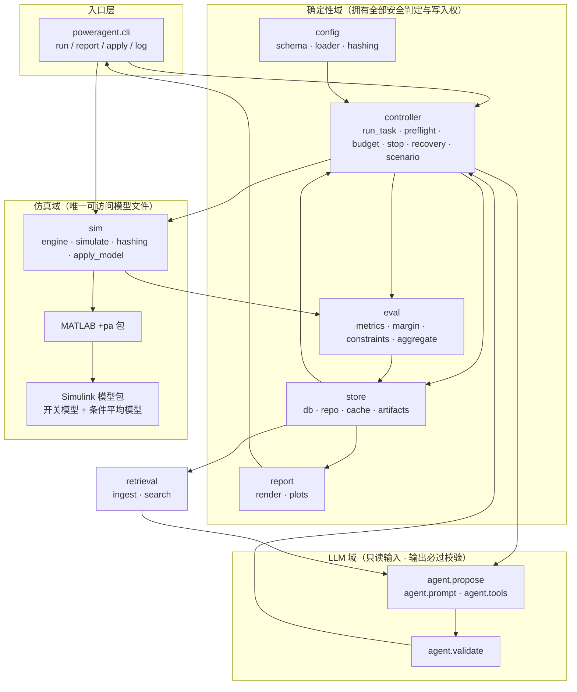
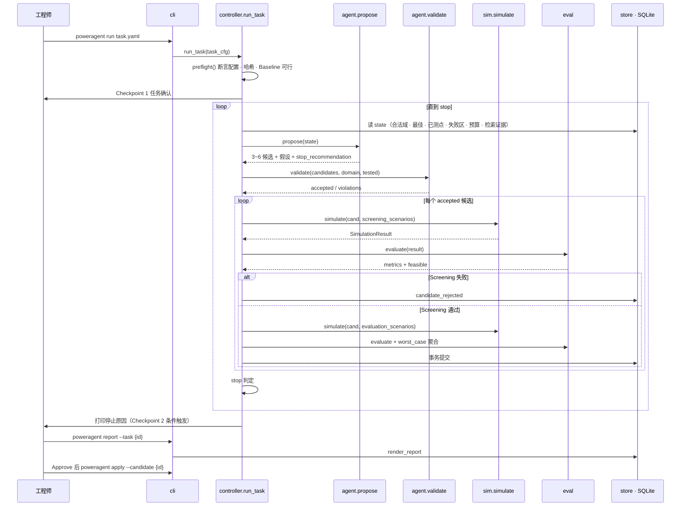
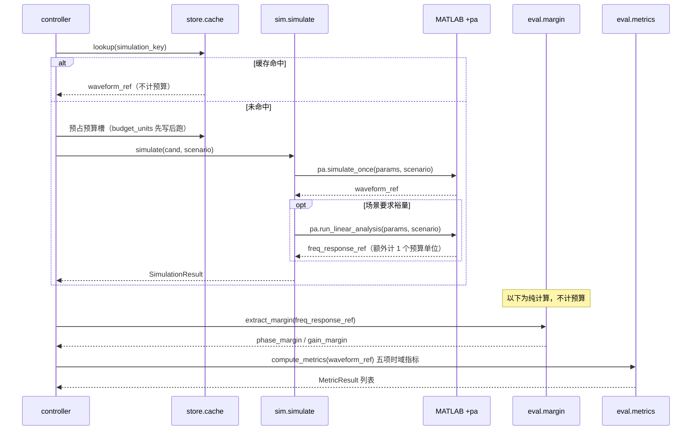
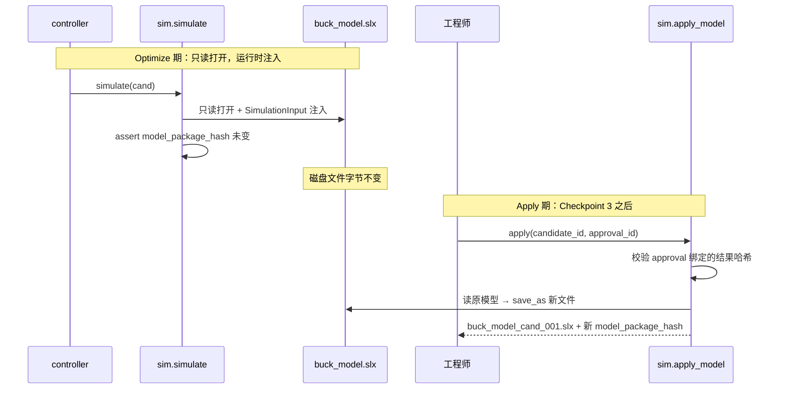
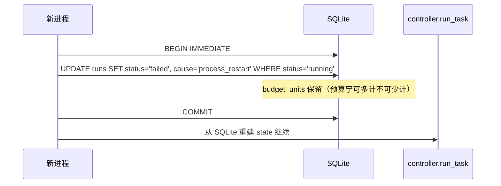

# 设计文档：multiphase-buck-power-agent

*AI芯片多相Buck供电模块 · 阶段1 · V2.0 规格书的工程化实现设计*

| 控制项 | 内容 |
| --- | --- |
| 基线文档 | `设计文档/AI芯片多相Buck供电模块_阶段1正式设计规格书_V2.0.md`（实施基线） |
| 本文档性质 | V2.0 的忠实工程化转写，只回答「怎么落地」 |
| 覆盖范围 | High-Level Design（架构、组件、数据模型）+ Low-Level Design（函数签名、伪代码、算法） |
| 下游产物 | `tasks.md`（可执行开发任务清单） |

---

## 0 本文档的写作约束

### 0.1 唯一基线

V2.0 是唯一基线。本文档不改变 V2.0 的任何核心设计思想，只把它的判断翻译成模块边界、接口签名、数据结构、schema 与算法。V2.0 中的背景论述、商业价值、削减理由不在此重复；需要引用时以「V2.0 §x.y」标注出处。

### 0.2 不得引入的组件（负向清单）

以下组件在 V1.x → V2.0 的三轮削减中被明确删除，**开发任务中不得出现，代码中不得出现对应模块、配置、测试层或验收标准**：

IntentParser 全链路（含 `TaskSpecValidator`、`poweragent plan`、`field_provenance`、黄金配置集）、Reporter LLM 角色、CitationValidator、DataPack 与 `datapack_hash`、Simple BO 回归基线与 Search Regression CI、三层 Policy 抽象（`ProposalPolicy` / `AlgorithmPolicy` / `AgentPolicy`）、`SimulationAdapter` ABC 与 `SIMPLISAdapter` 占位、`PriorPackage` 版本化格式与 `warm_start_disclosure`、搜索效率（Regret / Simulations-to-Target）作为结论指标、双层 Go/No-Go 预注册、H1~H6 假设表、Diagnostician 与 EvidenceValidator、跨范式对照与统计推断、Web/FastAPI/SSE、消息队列、Agent 编排框架、多 Agent 协作、Plugin 机制、Event Bus。

保留的数量约束（V2.0 修订记录）：**LLM 角色 1、确定性校验器 1、抽象层 0、配置文件 4、冻结点 3、失败分类 4、测试分层 7（+2 条件层）、验收标准 8、任务级指标 3、风险 6、术语 8。** 本文档的每一节都在这些数字内闭合。

本轮（V2.1 决策落地）对支撑表数量、`runs.cause` 取值集合与 `agent.validate` 的 `mode` 取值域有更新，判据与更新后的数字见 §0.5；上述保留约束一项未变。

### 0.3 记法选择（Low-Level Design 的语言）

V2.0 显式指定了实现语言，因此低层设计不使用语言无关伪代码作为唯一记法，而按层分记：

| 层 | 记法 | 依据 |
| --- | --- | --- |
| 控制器 / 评价 / 校验 / 检索 / 存储 / 报告 | Python 3.11 类型注解签名 | V2.0 §4「`run_task()` 普通Python函数」、§10.2「指标计算、校准编排、候选校验与硬约束判断属于Python确定性服务」、§14.1「Python CLI」 |
| 仿真后端 | MATLAB 函数签名（`+pa` 包） | V2.0 §10.2「Block Path、SimulationInput、logsout、求解器、模型工作区、线性化调用与MAT文件操作全部封装在MATLAB侧」 |
| 算法流程 | 结构化伪代码（`pascal` 代码块） | V2.0 自身的记法约定；本文档 §8 |
| 数据查询 | SQLite SQL | V2.0 §11.2 要求 worst-case 聚合由 SQL 判定 |
| 配置 | YAML | V2.0 §3.4 四个配置文件 |

### 0.4 V2.0 章节 → 本文档映射

本文档的二级标题采用规范英文名，章节编号写在标题下方的中文小字里；下表与全文的 `§编号` 引用仍按编号定位，编号未做任何变动。

| V2.0 章节 | 本文档 |
| --- | --- |
| §3 前置探针与启动门禁 | §6.2 `preflight()`、§4.1 `task.yaml`、§8.2、§16 里程碑映射 |
| §3.2 M-1 模型使能与依赖闭包哈希 | §4.2 `model.yaml`、§6.4 MATLAB 侧、§6.3 `hashing.py` |
| §4 总体架构 | §2 Architecture、§3 时序 |
| §5 数据与模型校准 | §4.4 校准配置、§6.11 `calib` 模块 |
| §6.1 指标定义 | §4.3 `metrics.yaml`、§6.5.1 `metrics.py` |
| §6.2 稳定性裕量 | §6.5.2 `margin.py`、§8.5 |
| §6.3 分层场景与目标 | §4.1 场景节、§5.1 `scenario_set`、§6.2.4 `scenario.py`、§8.4 |
| §6.4 Baseline 可行性门禁 | §6.2.2 `preflight`、§8.2 |
| §6.5 Optimize/Apply 分离 | §6.3.3 `apply_model.py`、§8.10、§10 CP-3 |
| §7 工程知识与检索 | §6.8 `retrieval` |
| §8 Agent 寻优 | §6.6 `propose`、§6.7 `validate`、§8.3、§8.9 |
| §9 基线与端到端评估 | §6.12 `reference`、§6.10 `report`、§5.1 埋点表 |
| §10 CLI 与接口 | §6.1 CLI、§6.3/§6.4 接口、§5.2 数据契约 |
| §11 存储、幂等与失败处理 | §5 Data Models、§6.9 `store`、§8.6、§8.8、§11 Error Handling |
| §12 测试与质量门禁 | §10 Correctness Properties、§12 Testing Strategy |
| §13 优先级与里程碑 | §16 任务分解映射 |

### 0.5 本轮修订的判据（V2.1 决策落地）

`requirements.md` 文末的 `## 实现前需 Owner 决策的遗留项`（L5-1 ~ L24-3）已由 Owner 授权按设计判断一次性裁定，裁定登记见 §17.2。**原「不得新增配置项 / 表列 / 错误类型」的禁令在本轮解除，但仅限 §17 明确登记的新增，不得自行扩展。**

条目数：该节实际逐条列出 **78 个** L 编号（无重复），§17.2 按 78 条逐一登记。原 `requirements.md` 与 `tasks.md` 中「共 71 条」的笔误已同步更正 —— `requirements.md` 的遗留项一节已替换为《仍需 M0 填写的物理数值》，`tasks.md` 的 Overview 已改为「全部 78 条遗留项已裁定」。

四条判据。全文每处裁定都可回溯到其中之一：

1. **不引入可配置的灵活性来回避决策。** 能用固定枚举就不做表达式 DSL（`invalid_if` 落成 8 项具名谓词而非表达式语法，§4.3）；能用构造保证就不做运行期校验（`ArtifactStore.stage()` 把临时文件写在最终路径同目录，取代跨卷断言，§6.9）。
2. **能删就删，不能删才加。** 本轮删除 2 项（`runs.cause` 取值 `retrieval_insufficient`、状态行的「LLM 累计成本」字段）、改名 1 项（`budget.max_transient_retries` → `budget.max_attempts_per_scenario`）、简化 1 处配置字段（`invalid_if` 由表达式降为枚举子列表）。
3. **被正确性属性强制的地方按属性走，不按成本走。** `evaluation_key` 命中仍写 `runs` 行（CP-6 的完备性判定依赖它，§5.4）；裕量提取失败在 Evaluation 层跑完该层其余场景行（完整证据优先于省预算，§8.4）。
4. **物理数值（阈值、容差、范围）仍为 `<...>` 占位，由 Owner 在 M0 填写。** 本轮只定机制、字段、口径与控制流；待填数值清单单列在 §17.3。

本轮变更导致的数量更新（均不触及 §0.2 的保留约束）：

| 项 | 原 | 现 | 依据 |
| --- | --- | --- | --- |
| 支撑表 | 3（`scenario_set`、`evidence`、`freezes`） | 5（+`baselines`、`rejections`） | 冻结前值基线与校验期被拒候选无既有落库位置，且不得扩张 `freezes.kind`（保住「冻结点 3」） |
| `runs.cause` 取值集合 | — | 删 `retrieval_insufficient`、增 `artifact_missing` | 判据 2 与 §11.1 |
| `agent.validate` 的 `mode` | 2（`explore`/`local_refine`） | 3（+`grid`） | Dense Grid 的 144 点须过 `validate()`（CP-2）又不应受新颖度约束 |

8 个主要实体、4 个配置文件、3 个冻结点、4 类失败分类、7+2 测试层、4 个 CLI 命令、1 个 LLM 角色、1 个确定性校验器、0 个抽象层、3 项任务级指标均不变。

---

## Overview

*§1 概述 · 系统全貌、三个信任域、两个扩展点*

系统是一个单机 CLI 程序：读取四个 YAML 配置，在确定性控制器 `run_task()` 的调度下反复执行「ProposalAgent 提出候选 → 确定性校验 → Simulink 仿真 → 确定性评价 → 落库」的闭环，直到预算耗尽、连续无改善或触发人工介入条件；随后由 Jinja2 模板从 SQLite 渲染寻优前后对比报告，工程师批准后另存新模型文件。

实现上分三个信任域，边界由 Python 包结构强制：**确定性域**（`controller` / `eval` / `store` / `report` / `config`，拥有全部安全判定与事实写入权）、**LLM 域**（`agent.propose`，只读输入、只输出候选与假设、输出必过 `agent.validate`）、**仿真域**（`sim` + MATLAB `+pa` 包，唯一有权访问模型文件的组件，寻优期只读）。

系统只有 7 个模块、1 个 LLM 角色、0 个抽象层。两个扩展点是函数边界而非抽象层：`propose(state) -> list[Candidate]` 与 `simulate(candidate, scenario) -> SimulationResult`。

---

## Architecture

*§2 架构 · 模块边界与信任域、目录结构、模块职责与禁止事项*

### 2.1 模块边界与信任域



依赖方向的硬规则（由 `tests/unit/test_import_boundaries.py` 断言，对应 V2.0 §8.3 与 §12.2-6）：

```text
agent.*      不得 import  sim.*  store.db(写)  config.loader(写)  eval.constraints(判定入口)
eval.*       不得 import  agent.*  sim.simulate
sim.*        不得 import  eval.*  agent.*
report.*     不得 import  agent.*  sim.*
controller.* 可以 import  全部；只有 controller 与 cli 能编排
```

`sim` 是唯一 import MATLAB Engine 的包；`eval` 只接受波形/观测量引用，不认识 `slx`、`SimulationInput`、`logsout`。

### 2.2 目录结构

```text
poweragent/
├─ pyproject.toml                 # 依赖锁定，见 §15
├─ configs/
│  ├─ task_template.yaml          # 每字段带单位 / 合法范围 / 来源注释
│  ├─ model.yaml
│  ├─ metrics.yaml
│  └─ constraints.yaml
├─ prompts/
│  ├─ propose.system.md
│  └─ propose.user.j2             # 确定性拼装模板
├─ templates/
│  └─ report.md.j2
├─ matlab/+pa/                    # MATLAB 侧封装（§6.4）
│  ├─ inspect_model.m
│  ├─ simulate_once.m
│  ├─ simulate_batch.m
│  ├─ export_observables.m
│  ├─ run_linear_analysis.m
│  └─ private/{apply_params.m,collect_signals.m,map_error.m}
├─ src/poweragent/
│  ├─ cli.py
│  ├─ config/{schema.py,loader.py,hashing.py}
│  ├─ controller/{run_task.py,preflight.py,budget.py,stop.py,recovery.py,scenario.py}
│  ├─ sim/{engine.py,simulate.py,hashing.py,apply_model.py}
│  ├─ eval/{metrics.py,margin.py,constraints.py,aggregate.py}
│  ├─ agent/{propose.py,prompt.py,schema.py,validate.py,tools.py}
│  ├─ retrieval/{ingest.py,search.py}
│  ├─ store/{db.py,ddl.sql,repo.py,cache.py,artifacts.py}
│  ├─ report/{render.py,plots.py}
│  ├─ calib/{estimate.py,residual.py}      # 条件模块，M2
│  ├─ reference/dense_grid.py               # M3
│  └─ robustness/sweep.py                   # M6
└─ tests/
   ├─ unit/  fixtures/  matlab_contract/  integration/  recovery/  conditional/
```

运行期产物（V2.0 §11.1）：

```text
runs.db                                     # 唯一事实源
artifacts/
├─ margin_cross_check.json                  # 裕量交叉核对记录：模型与方法的属性，非任务属性
│                                           # 因此不按 task 分目录（§4.3）
└─ <task_id>/
   ├─ config/      # 四个 yaml 的快照 + 各自哈希
   ├─ waveforms/   # <run_id>.mat / .npz
   ├─ metrics/     # <run_id>.json（含观测量与裕量原始频响）
   ├─ plots/       # 波形图、响应面图
   ├─ reports/     # report_<task_id>.md
   ├─ approvals/   # <approval_id>.json，绑定不可变结果哈希
   └─ llm/         # <llm_call_id>.{prompt.txt,output.json}
```

临时文件不单设目录：`ArtifactStore.stage()` 把它写在最终路径的同一目录下（`.<name>.tmp`），从构造上保证原子移动同卷（§6.9）。

### 2.3 模块职责与禁止事项

对齐 V2.0 §4 的七模块表，展开到包级：

| 模块 | 做什么 | 不做什么 |
| --- | --- | --- |
| `cli` | 解析命令、加载配置、打印状态、记录人工干预 | 不决定候选、场景、重试；不直接调 MATLAB（`apply` 除外，走 `sim.apply_model`） |
| `config` | 四文件 schema 校验、单位与范围检查、跨文件一致性检查（`divergence_guard` ≥ 硬约束、单位两处一致、`ticks` 等比、`tick_match_rel_tol` 上界）、计算 `metrics_hash` / `constraints_hash` / `scenario_set_hash`、冻结点比对 | 不推断缺失字段、不填默认物理值 |
| `controller` | 状态迁移、预算、停止、重试、恢复、审批暂停、场景调度、prompt 触发 | 不生成候选、不计算物理量、不写模型文件 |
| `agent.propose` | 依 `state` 输出 3~6 候选与搜索假设 | 不调仿真、不写事实状态、不改约束/预算/场景 |
| `agent.validate` | 单位量纲、合法域与档位、重复与新颖度（三种 `mode` 见 §6.7） | 不调 LLM、不「修正」语义、不放宽边界、不决定自己的 `mode` |
| `sim` | 参数运行时注入、模型运行、结果引用、依赖闭包哈希、Apply 另存 | 不接受任意 MATLAB 命令、不算指标、寻优期不写模型 |
| `eval` | 六项指标、硬约束判定、worst-case 聚合、排序键 | 不调 LLM、不发起仿真（裕量所需仿真由 `controller` 经 `sim` 发起） |
| `store` | 事务、幂等、两级缓存、产物原子落盘 | 不做业务判定 |
| `retrieval` | 摄取与检索，返回三元组 | 不写候选参数、不覆盖 `constraints.yaml` |
| `report` | Jinja2 渲染 SQLite | 不引入库外数值、不判项目结论、不签审批 |

---

## 3 时序图

### 3.1 主寻优闭环（V2.0 §4）



### 3.2 单候选两级场景与相位裕量（V2.0 §6.2 / §6.3）



### 3.3 Optimize / Apply 分离（V2.0 §6.5）



### 3.4 中断与恢复（V2.0 §11.2）



---

## 4 配置文件 Schema

四个文件，与 V2.0 §3.4 一一对应。`config/schema.py` 用 pydantic v2 落成强类型模型；每个待填字段在模板中带单位、合法范围、来源注释。**下列所有 `<...>` 占位值由对应 Owner 在 M0 填写，程序不得推断默认物理值。**

### 4.1 `task.yaml`（Owner：使用者）

```yaml
task_id: t_2026_0901_transient          # 字符串，唯一
simulation_only: true                    # 验收轨道开关（V2.0 §1.3）；true=PoC轨
objective_target:                        # 可选；给出则参与 stop 判定
  target_value: <us>                     # 比较对象是 metrics.yaml 的 objective.primary 聚合值
                                         # （worst_case_settling_time）；单位随该指标
                                         # 比较为严格 value <= target_value，不套 tie_tolerance
budget:
  max_engine_starts: <int>               # 预算单位=真实启动 Simulink 次数（V2.0 §11.3）
  max_wallclock_hours: <float>
  max_attempts_per_scenario: 2           # 每候选每场景的最大 attempt 数（2 = 最多重试 1 次）
  max_llm_repair_rounds: 2               # schema 校验失败回灌重试上限（V2.0 §8.2）；schema 约束 0 <= v <= 5
llm:
  timeout_s: 120                         # 单次 LLM 调用超时
  max_network_retries: 2                 # 网络类失败的指数退避重试上限；不计入 max_llm_repair_rounds
stop:
  no_improvement_rounds: <int>           # 连续无改善轮数
  stop_on_first_feasible: false          # 见 §17 Q4
scenarios:                               # 显式行，禁止笛卡尔积（V2.0 §6.3）
  - scenario_id: scr_nom
    tier: screening
    model_variant: averaged              # switching | averaged
    vin_v: <V>
    temp_c: <degC>
    load_start_a: <A>
    load_end_a: <A>
    slew_a_per_us: <A/us>
    require_margin: false
  - scenario_id: eval_vin_min_step_max
    tier: evaluation
    model_variant: switching
    vin_v: <V>
    temp_c: <degC>
    load_start_a: <A>
    load_end_a: <A>
    slew_a_per_us: <A/us>
    require_margin: true
robustness:                              # 仅 M6 Top 候选使用（V2.0 §6.3）
  component_tolerance:
    - parameter: cout_c
      relative_range: [<low>, <high>]
  include_calibration_uncertainty: true  # PoC 轨自动为 false 并在报告说明
```

`llm` 节的两类失败严格分开，因此 `llm_calls.outcome` 的四值枚举不扩张：

| 失败类型 | 处理 | 计数归属 | `outcome` |
| --- | --- | --- | --- |
| 输出不合 schema | 回灌错误清单重试 | `budget.max_llm_repair_rounds` | `schema_invalid` / `repaired` |
| 网络失败或超时 | 指数退避重试至 `llm.max_network_retries` | 不计入修复轮 | 重试耗尽时写一条 `llm_calls` 行、`outcome='empty'` |

网络重试耗尽等价于本轮无候选，由 `run_task()` 按空候选集处理（§8.1 的空轮分支），不引入新的失败分类。修复轮与网络重试均不消耗 engine 预算，只计 token。

`budget.max_attempts_per_scenario` 是 V2.0 `max_transient_retries` 的改名：原名读作「最大重试次数」而实际语义是「最大 attempt 数」，默认 2 时只重试 1 次。改名而非加注释，是因为名称与语义不一致的字段在实现期一定会被误读一次。

### 4.2 `model.yaml`（Owner：模型 Owner）

```yaml
model_package:
  switching:
    entry: models/buck_12ph.slx
    referenced_models: [models/ref_ctrl.slx]
    data_dictionaries: [models/buck.sldd]
    matlab_functions: [matlab/+pa]
    init_scripts: [models/init_buck.m]
    mat_inputs: [data/load_profile.mat]
    custom_libraries: [libs/pwr_lib.slx]
  averaged:                              # 条件节；averaged_model_required=false 时留空
    entry: models/buck_12ph_avg.slx
    referenced_models: []
    data_dictionaries: [models/buck.sldd]
    matlab_functions: [matlab/+pa]
    init_scripts: [models/init_buck_avg.m]
    mat_inputs: []
    custom_libraries: [libs/pwr_lib.slx]
averaged_model_required: <bool>          # 来源：P-2 探针结论
io_contract:
  injectable_params:                     # Block Path ↔ SI 名称，唯一注入白名单
    rcomp: { block_path: "buck_12ph/Comp/Rcomp", param: "Resistance", unit: ohm }
    ccomp: { block_path: "buck_12ph/Comp/Ccomp", param: "Capacitance", unit: F }
  output_signals:
    vout:        { logsout_name: "Vout", unit: V }
    iout:        { logsout_name: "Iout", unit: A }
    iphase:      { logsout_name: "Iphase", unit: A, dimension: n_phase }
  solver: { type: ode23tb, max_step: <s>, rel_tol: <->, stop_time: <s> }
  initial_condition: steady_state_from_init_script
  vout_target_v: <V>                     # 标称输出电压；metrics.yaml 的 settling_time.band
                                         # = 0.01_of_vout_target 引用此量
  divergence_guard:                      # MATLAB 侧发散判据的硬安全界，与 eval 的评价阈值分离
    vout_abs_max: <V>                    # 推荐取 constraints.yaml hard_constraints.vout_max 的 2 倍
    iphase_abs_max: <A>                  # 推荐取 hard_constraints.peak_current_max 的 2 倍
baseline:                                # Engineering Baseline（V2.0 §6.4）
  parameters_si: { rcomp: <ohm>, ccomp: <F> }
  measured_evidence_ref: <path|null>     # 有实板记录则绑定，影响门禁失败的结论表述
runtime:
  matlab_release: R2024b
  toolboxes: [Simulink, "Simulink Control Design"]
  python_version: "3.11"
  execution_mode: serial                 # serial | fast_restart | parsim（parsim 需 P2 门禁）
  max_wallclock_per_run_s: <int>         # 单次仿真的墙钟上限，map_error.m 的 timeout 判据
                                         # 推荐 ceil(3 × probe.single_run_s)：超过探针实测 3 倍
                                         # 即视为卡死而非慢
dual_model_consistency:                  # 条件节；仅供 M-1/M0 的 Dual-Model Consistency 测试层
                                         # 与 preflight 消费，运行期不复核（§8.5）
  checkpoints: [ { scenario_id: scr_nom, steady_tol: <->, transient_tol: <-> } ]
```

`model_package_hash` 由 `sim/hashing.py` 对上述**依赖闭包全体文件 + `model.yaml` 本身规范化内容**计算，不得只对 `entry` 计算（V2.0 §3.2）。`averaged_model_required=true` 时哈希覆盖 switching 与 averaged 的合并闭包。

`divergence_guard` 与 `hard_constraints` 是两件事，不可合并：前者是 MATLAB 侧「这次仿真已经不成立」的判据，越界即 `status='diverged'`，不进入指标计算；后者是 `eval` 侧「这个候选不满足工程要求」的评价阈值，越界仍产出完整指标并记 `violations`。跨文件一致性由 `config` 层断言（`config` 加载全部四个文件，因此不破坏 §2.1 的导入边界）：

```text
divergence_guard.vout_abs_max   >= constraints.yaml: hard_constraints.vout_max.value
divergence_guard.iphase_abs_max >= constraints.yaml: hard_constraints.peak_current_max.value
```

不满足即报错：安全界低于评价阈值意味着合法候选会被误判为发散。

### 4.3 `metrics.yaml`（Owner：指标 Owner）

```yaml
active_metrics: [output_ripple, overshoot, undershoot, settling_time, phase_peak_current, phase_margin, gain_margin]
# V2.0 §6.1 的「六项指标」中第六项为「相位裕量（含增益裕量）」：一项指标两个数值，
# 实现上落成两个 metric_id（phase_margin / gain_margin），不构成第七项指标。
# efficiency 在二维阶段默认不激活（V2.0 §1.4）；sensitivity 见 §17 Q1。

metrics:
  settling_time:
    signal: Vout
    definition: 负载阶跃后回到误差带内并保持的所需时间
    window: [step_trigger, step_trigger_plus_500us]
    band: 0.01_of_vout_target            # vout_target 取 model.yaml 的 io_contract.vout_target_v
    filter: none
    unit: us
    invalid_if: [waveform_unreadable, signal_missing, window_empty,
                 waveform_not_converged, vout_out_of_guard,
                 no_step_detected, not_settled_within_window]
    compare_tolerance: { absolute: <us>, relative: <ratio> }
    threshold_source: approval_record
  output_ripple:   { signal: Vout,    window: [steady_start, steady_end], filter: <bw_hz>, unit: V,
                     invalid_if: [waveform_unreadable, signal_missing, window_empty, waveform_not_converged, vout_out_of_guard],
                     compare_tolerance: {...}, threshold_source: approval_record }
  overshoot:       { signal: Vout,    window: [step_trigger, step_trigger_plus_500us], filter: none, unit: V,
                     invalid_if: [waveform_unreadable, signal_missing, window_empty, waveform_not_converged, vout_out_of_guard, no_step_detected],
                     compare_tolerance: {...}, threshold_source: approval_record }
  undershoot:      { signal: Vout,    window: [step_trigger, step_trigger_plus_500us], filter: none, unit: V,
                     invalid_if: [waveform_unreadable, signal_missing, window_empty, waveform_not_converged, vout_out_of_guard, no_step_detected],
                     compare_tolerance: {...}, threshold_source: approval_record }
  phase_peak_current: { signal: Iphase, window: [sim_start, sim_end], filter: none, unit: A, aggregation: max_over_phases,
                     invalid_if: [waveform_unreadable, signal_missing, window_empty, waveform_not_converged],
                     compare_tolerance: {...}, threshold_source: approval_record }
  phase_margin:    { source: frequency_response, unit: deg, invalid_if: [extraction_failed],
                     compare_tolerance: { absolute: <deg> }, threshold_source: approval_record }
  gain_margin:     { source: frequency_response, unit: dB,  invalid_if: [extraction_failed],
                     compare_tolerance: { absolute: <dB> },  threshold_source: approval_record }

constraint_observables:                  # 硬约束的支撑观测量；不是项目指标，见下方说明
  obs.vout_min: { signal: Vout, window: [sim_start, sim_end], aggregation: min, unit: V }
  obs.vout_max: { signal: Vout, window: [sim_start, sim_end], aggregation: max, unit: V }

margin_extraction:                       # V2.0 §6.2
  primary_method: <linear_analysis_on_averaged | freq_response_estimator_on_switching>
  cross_check_method: <manual_bode_reference | the_other_method>
  cross_check_tolerance: { phase_deg: <deg>, gain_db: <dB> }
  cross_check_record:                    # 开发期一次性核对的落点，preflight 断言其存在与内容一致
    path: artifacts/margin_cross_check.json
    sha256: <hex>
  extra_engine_starts_per_candidate: <int>   # 来源：P-2 实测，计入预算；schema 约束 0 <= v <= 4

objective:
  primary: { metric_id: settling_time, aggregation: max_over_completed_evaluation_set, direction: minimize }
  tie_tolerance: <us>
  secondary_lexicographic:               # 未激活项自动跳过；sensitivity 见 §17 Q1
    - { metric_id: phase_margin, direction: maximize }
    - { metric_id: efficiency,   direction: maximize }
    - { metric_id: sensitivity,  direction: minimize }
```

#### `invalid_if` 是固定枚举，不是表达式

取值域封闭为下列 8 项，每项对应 `eval/metrics.py` 中一个具名谓词函数（§6.5.1）。每个指标的 `invalid_if` 是该枚举的**子列表**，`config.schema` 断言只用了适用于该指标的谓词。

| 枚举值 | 判据 | 适用范围 |
| --- | --- | --- |
| `waveform_unreadable` | 波形产物不可读或往返校验失败 | 全部时域指标 |
| `signal_missing` | `MetricSpec.signal` 指定的信号在产物中不存在 | 全部时域指标 |
| `window_empty` | 计算窗口内无采样点 | 全部时域指标 |
| `waveform_not_converged` | 仿真末 10% 窗口的 Vout 峰峰值大于稳态判定带 | 全部时域指标 |
| `vout_out_of_guard` | Vout 越 `model.yaml` 的 `io_contract.divergence_guard` | Vout 类指标 |
| `no_step_detected` | 阶跃触发点未识别 | 仅阶跃类指标（`settling_time` / `overshoot` / `undershoot`） |
| `not_settled_within_window` | 窗口内未回到误差带 | 仅 `settling_time` |
| `extraction_failed` | 频响提取失败 | 仅 `phase_margin` / `gain_margin` |

放弃表达式语法的理由（§0.5 判据 1）：表达式 DSL 需要一套解析器、一套求值器、一套注入防护和一套语法测试，换来的是「以后可以不改代码加判据」——而物理无效判据的数量是有限且低频变化的。用可配置性回避「这五项指标的无效条件到底是什么」这个决策，与 V2.0 的削减精神冲突。

#### `constraint_observables` 不是项目指标

它们是硬约束的支撑观测量，与「六项指标」是两个集合：

- **不进** `active_metrics`、**不进** `objective`、**不参与** CI 回归的指标断言、**不计入**「六项指标」的数量约束。
- **由** `eval.metrics` 在同一次波形遍历中产出（恒定计算，不受 `active_metrics` 开关影响），落到同一张 `metric_results` 表，`metric_id` 带 `obs.` 前缀以示区分。

只两项。`peak_current_max` 直接绑既有 `phase_peak_current`，`phase_margin_min` 绑既有 `phase_margin`，不再造重复观测量。

#### `cross_check_record` 的落点

`artifacts/margin_cross_check.json`，**不按 task 分目录**：裕量交叉核对是模型与提取方法的开发期属性，不是任务属性；同一模型包下的所有任务共用同一份核对记录。`preflight` 断言该文件存在且内容 sha256 与配置字段一致，不新增表（保住「冻结点 3」与 8 个主要实体）。

### 4.4 `constraints.yaml`（Owner：电源设计）

必须分两节，硬约束节顶部写变更须重新审批（V2.0 §3.4）。

```yaml
# ===== 本节变更需重新审批（M0 出口冻结） =====
hard_constraints:
  vout_min:          { value: <V>,   observable: obs.vout_min,       sense: lower, applies_to_tier: [screening, evaluation] }
  vout_max:          { value: <V>,   observable: obs.vout_max,       sense: upper, applies_to_tier: [screening, evaluation] }
  peak_current_max:  { value: <A>,   observable: phase_peak_current, sense: upper, applies_to_tier: [screening, evaluation] }
  phase_margin_min:  { value: <deg>, observable: phase_margin,       sense: lower, applies_to_tier: [evaluation] }
# =============================================

design_space:                            # 变更频率高于硬约束节
  variables:
    rcomp:
      unit: ohm
      domain: [<low>, <high>]
      scale: log
      ticks: <explicit list | {count: 12, spacing: log}>   # Dense Grid 与 validate 共用同一档位定义
    ccomp:
      unit: F
      domain: [<low>, <high>]
      scale: log
      ticks: <explicit list | {count: 12, spacing: log}>
  novelty_min_ticks: 1.0                 # 探索阶段最小档位距离
  tick_match_rel_tol: 1e-6               # 档位命中的相对容差；见下方说明
  device_limits:                         # 关键器件参数，唯一权威来源（V2.0 §7）
    cout_c:      { value: <F>,  source: <datasheet ref> }
    cout_esr:    { value: <ohm>, source: <datasheet ref> }
    l_per_phase: { value: <H>,  source: <datasheet ref> }
```

#### 硬约束到支撑指标的映射：`observable` + `sense`，删除 `model_variant`

`judge()` 按 `observable` 取值、按 `sense` 比较（`lower` ⟹ 值 ≥ `value` 判满足；`upper` ⟹ 值 ≤ `value` 判满足；**取等判满足**），按 `applies_to_tier` 门控。`preflight` 断言每条硬约束的 `observable` 或在 `metrics.yaml` 的 `constraint_observables` 中、或在 `active_metrics` 中，否则 `judge()` 无据可依。

删除 `model_variant` 字段同时消解了 V2.0 §6.2 与 §6.3 的口径冲突（原 §17 Q2 与 L24-3）：**判定使用的模型变体不由约束声明，而由该 run 所在场景的 `model_variant` 与观测量的可得性决定。** 理由是原设计把「在哪个模型上判」写进约束，与「Screening 用平均模型粗筛、Evaluation 用开关模型定论」的分层目的直接矛盾——分层的意义就在于同一条约束在两层上用不同代价的模型判两次。

- `obs.vout_min` / `obs.vout_max` / `phase_peak_current` 在开关与平均模型上都能算，因此两层都能判：Screening 层用该层场景行指定的变体做粗筛，Evaluation 层用开关模型做最终判定。
- `phase_margin` 只在 `require_margin=true` 的场景采集，而这类场景只出现在 Evaluation 层，因此 `phase_margin_min` 天然只在 Evaluation 层生效，无需额外声明。

#### 档位命中：规范化优先，容差兜底

`ticks` 展开后的档位值一律经 `format(v, ".12g")` 规范化再使用。**写入 prompt 的档位字面量与校验时的档位值是同一组十进制文本**，Agent 照抄即可精确命中；`tick_match_rel_tol` 只作兜底：

```text
命中判定：|v − tick| <= tick_match_rel_tol × |tick|
schema 断言：tick_match_rel_tol < 0.01 × (tick_ratio − 1)
```

后一条保证容差远小于相邻档位间隔，不会让两个相邻档位混淆。

`ticks` **强制等比**：`config.schema` 断言显式列表的相邻比在 `1e-6` 相对容差内一致，不等比即报错。理由：二维阶段的档位定义就是对数等距（`{count: 12, spacing: log}` 是默认形式），允许不等比只会让 `tick_distance` 里的 `tick_ratio_i` 失去唯一定义，从而使新颖度度量失效。

#### 4.4.1 `configs/calibration.yaml`（条件产物，M2 生成）

校准参数与设计变量分表（V2.0 §5.2）。该文件由 `calib` 模块生成而非人工填写，因此不计入「配置文件 4」；其中 `calibration_uncertainty_for_robustness` 节按 V2.0 §5.3 格式输出，PoC 轨为空。本轮补齐三项口径：

```yaml
confidence_level: 0.95                   # confidence_interval 的置信水平
dataset_partition:
  min_triplets_per_partition: 2          # calibration / validation / test 各分区下限
  test_min_condition_groups: 2           # Test 分区额外要求覆盖至少 2 个不同工况组
multi_start:
  spread_warn_rel: 0.10                  # 采纳解与其余收敛解的相对离散度 > 10% 时告警
                                         # 要求工程师复核，不阻断
```

`spread_warn_rel` 取告警而非门禁：多初值离散度大说明目标函数存在多个局部解，这是需要工程师看残差图判断的情形，机器无权代替他判定哪个解可信。

### 4.5 冻结点的机器化表示

三个冻结点（V2.0 §3.4）落成 `store` 中的 `freezes` 支撑表 + `preflight()` 断言，不引入额外配置文件：

| 冻结点 | 机器化形式 | 校验时机 |
| --- | --- | --- |
| 模型包 | `freezes(kind='model_package', hash=model_package_hash, frozen_at)` | 每次 `preflight()` 与每次 `simulate()` 前 |
| 安全边界与评价定义 | `freezes(kind='safety', hash=H(constraints_hash, metrics_hash, scenario_set_hash))`；`metrics_hash` 允许在 M1 出口前更新一次（容差补齐），之后锁定 | 每次 `preflight()` |
| 任务集 | `task_set.md` 的 sha256 + 定稿日期写入 `freezes(kind='task_set')` | M5 起 `preflight()` 告警式校验 |

`task_set.md` 内加注的定稿日期与 `freezes(kind='task_set').frozen_at` 的一致性**不做机器校验**，由人工核对（L21-3）：解析人写的自然语言日期属过度设计，而 sha256 已经保证内容未变——日期只是给人看的标注。

---

## Data Models

*§5 数据模型 · SQLite 物理模型、跨模块数据契约、两级缓存键、聚合判定路径*

### 5.1 SQLite 物理模型

8 个主要实体（V2.0 §11.1）+ **5 张支撑表**（`scenario_set`、`evidence`、`freezes`、`baselines`、`rejections`）。**`status` 列只存在于 `runs` 表**（V2.0 §4「一张 runs 表加一个 status 列」）；其余表不设状态列，`tasks.stop_reason` 只在任务终止时写一次，不参与状态机。

支撑表由 3 张增至 5 张（§0.5 的数量更新），8 个主要实体不变。增量理由：`baselines` 承载冻结前值基线——落 `freezes` 需新增 `kind` 取值，会破坏「冻结点 3」；`rejections` 承载校验期被拒候选——它们没有 `simulation_key` 与 `scenario_id`，写不进 `runs`，而 `candidates` 表按设计只存进入仿真的候选。两者都是「无既有落库位置」而非「为方便新建表」。

```sql
PRAGMA journal_mode=WAL;
PRAGMA foreign_keys=ON;

CREATE TABLE tasks (
  task_id              TEXT PRIMARY KEY,
  simulation_only      INTEGER NOT NULL,
  task_kind            TEXT NOT NULL,          -- optimize | dense_grid | robustness | baseline_gate
  model_package_hash   TEXT NOT NULL,
  metrics_hash         TEXT NOT NULL,
  constraints_hash     TEXT NOT NULL,
  scenario_set_hash    TEXT NOT NULL,
  execution_env_hash   TEXT NOT NULL,
  calibration_hash     TEXT NOT NULL DEFAULT '',  -- 绑定 configs/calibration.yaml 与数据集划分记录
                                                  -- PoC 轨为空串；工程轨 M2 之后非空
  budget_max_starts    INTEGER NOT NULL,
  started_at           TEXT NOT NULL,
  ended_at             TEXT,
  stop_reason          TEXT,                   -- §11.1 四类之一 + target_reached | no_improvement
  cause                TEXT                    -- stop_reason 的伴随 cause，重启后可回溯
);

CREATE TABLE scenario_set (                    -- 冻结的显式场景行
  task_id       TEXT NOT NULL REFERENCES tasks(task_id),
  scenario_id   TEXT NOT NULL,
  tier          TEXT NOT NULL CHECK (tier IN ('screening','evaluation','robustness')),
  model_variant TEXT NOT NULL CHECK (model_variant IN ('switching','averaged')),
  require_margin INTEGER NOT NULL,
  spec_json     TEXT NOT NULL,                 -- vin/temp/load/slew 规范化 JSON
  spec_version  TEXT NOT NULL,
  PRIMARY KEY (task_id, scenario_id)
);

CREATE TABLE candidates (
  candidate_id       TEXT PRIMARY KEY,         -- sha256(parameters_si 规范化 JSON)[:16]
  task_id            TEXT NOT NULL REFERENCES tasks(task_id),
  parameters_si      TEXT NOT NULL,            -- {"rcomp":11000.0,"ccomp":2.3e-9}
  origin             TEXT NOT NULL CHECK (origin IN ('agent','baseline','dense_grid','manual')),
  origin_llm_call_id TEXT REFERENCES llm_calls(llm_call_id),
  round_index        INTEGER,
  created_at         TEXT NOT NULL
);

CREATE TABLE runs (                            -- 粒度 (candidate_id, scenario_id, attempt)
  run_id           TEXT PRIMARY KEY,
  task_id          TEXT NOT NULL REFERENCES tasks(task_id),
  candidate_id     TEXT NOT NULL REFERENCES candidates(candidate_id),
  scenario_id      TEXT NOT NULL,
  attempt          INTEGER NOT NULL,
  status           TEXT NOT NULL CHECK (status IN ('running','waiting','done','failed')),
  failure_class    TEXT CHECK (failure_class IN ('candidate_rejected','transient_error','stop_and_ask_human','budget_exhausted')),
  cause            TEXT,
  simulation_key   TEXT NOT NULL,
  evaluation_key   TEXT,
  budget_units     INTEGER NOT NULL DEFAULT 0, -- 真实 engine 启动数；缓存命中为 0
  cache_hit        INTEGER NOT NULL DEFAULT 0,
  waveform_ref     TEXT,
  observable_ref   TEXT,
  elapsed_ms       INTEGER,
  started_at       TEXT NOT NULL,
  ended_at         TEXT,
  UNIQUE (task_id, candidate_id, scenario_id, attempt)
);
CREATE INDEX idx_runs_simkey ON runs(simulation_key);
CREATE INDEX idx_runs_cand   ON runs(task_id, candidate_id, status);

CREATE TABLE metric_results (
  run_id         TEXT NOT NULL REFERENCES runs(run_id),
  metric_id      TEXT NOT NULL,
  value          REAL,
  valid          INTEGER NOT NULL,
  invalid_reason TEXT,
  evaluation_key TEXT NOT NULL,
  PRIMARY KEY (run_id, metric_id)
);

CREATE TABLE constraint_results (
  candidate_id   TEXT NOT NULL REFERENCES candidates(candidate_id),
  scenario_id    TEXT NOT NULL,
  run_id         TEXT NOT NULL REFERENCES runs(run_id),
  feasible       INTEGER NOT NULL,
  violations     TEXT NOT NULL,                -- JSON 数组：[{constraint,limit,actual,unit}]
  evaluation_key TEXT NOT NULL,
  PRIMARY KEY (candidate_id, scenario_id, run_id)
);

CREATE TABLE approvals (
  approval_id   TEXT PRIMARY KEY,
  task_id       TEXT NOT NULL REFERENCES tasks(task_id),
  kind          TEXT NOT NULL,                 -- checkpoint1 | budget_increase | final_recommendation
                                               -- | track_selection | m5_assessment
  candidate_id  TEXT REFERENCES candidates(candidate_id),
  result_hash   TEXT NOT NULL,                 -- 绑定不可变结果（V2.0 §11.1）
  approver      TEXT NOT NULL,
  second_approver TEXT,                        -- 仅验收轨道与最终推荐双签
  decision      TEXT NOT NULL CHECK (decision IN ('approve','reject')),
  extra_units   INTEGER,                       -- 仅 kind='budget_increase' 非空；追加的 engine 启动额度
  note          TEXT,
  created_at    TEXT NOT NULL
);

CREATE TABLE interventions (                   -- V2.0 §9.4 埋点，M1 起连续
  intervention_id TEXT PRIMARY KEY,
  task_id      TEXT NOT NULL REFERENCES tasks(task_id),
  checkpoint   TEXT NOT NULL CHECK (checkpoint IN ('cp1','cp2','cp3','other')),
  reason       TEXT NOT NULL,
  action       TEXT NOT NULL,
  created_at   TEXT NOT NULL
);

CREATE TABLE llm_calls (                       -- V2.0 §9.4 六字段
  llm_call_id TEXT PRIMARY KEY,
  task_id     TEXT NOT NULL REFERENCES tasks(task_id),
  role        TEXT NOT NULL,                   -- 阶段1 仅 'proposal'
  model_id    TEXT NOT NULL,
  prompt_hash TEXT NOT NULL,
  context_hash TEXT NOT NULL,
  tokens      INTEGER NOT NULL,
  outcome     TEXT NOT NULL,                   -- ok | schema_invalid | repaired | empty
  evidence_ids TEXT,                           -- JSON 数组
  created_at  TEXT NOT NULL
);

CREATE TABLE evidence (
  evidence_id TEXT PRIMARY KEY,
  source      TEXT NOT NULL,                   -- datasheet | app_note | experience_card | history_report
  locator     TEXT NOT NULL,                   -- 文件 + 页/节
  text_hash   TEXT NOT NULL,
  ingested_at TEXT NOT NULL
);

CREATE TABLE freezes (
  kind      TEXT PRIMARY KEY,                  -- model_package | safety | task_set（恰好三个，不扩张）
  hash      TEXT NOT NULL,
  detail    TEXT,
  frozen_at TEXT NOT NULL
);

CREATE TABLE baselines (                       -- 冻结的前值基线（交付物5）
  gate_key           TEXT PRIMARY KEY,         -- H(model_package_hash, constraints_hash,
                                               --   metrics_hash, scenario_set_hash)
  task_id            TEXT NOT NULL REFERENCES tasks(task_id),  -- 产生该基线的 baseline_gate task
  passed             INTEGER NOT NULL,
  frozen_result_hash TEXT,                     -- passed=1 时非空
  diagnosis_ref      TEXT,                     -- passed=0 时非空，指向排查结论文件
  frozen_at          TEXT NOT NULL
);

CREATE TABLE rejections (                      -- 校验期被拒候选：无 simulation_key 与 scenario_id
  rejection_id   TEXT PRIMARY KEY,
  task_id        TEXT NOT NULL REFERENCES tasks(task_id),
  round_index    INTEGER NOT NULL,
  llm_call_id    TEXT REFERENCES llm_calls(llm_call_id),
  raw_parameters TEXT NOT NULL,                -- 原始取值的规范化 JSON
  reason         TEXT NOT NULL,                -- Literal 枚举，取值同 candidate_rejected 的校验类 cause
  created_at     TEXT NOT NULL
);
```

`llm_calls.tokens` **保持单列**，口径固定为 prompt 与 completion token 数之和。不分列以保住 V2.0 §9.4 的六字段：分列的唯一用途是成本核算，而成本已从状态行删除（§6.1）。

### 5.2 跨模块数据契约

V2.0 §10.3 的最小字段集合落成 frozen dataclass。所有跨模块参数使用 SI 单位与规范化名称。

```python
# poweragent/store/repo.py 与各模块共享
from dataclasses import dataclass
from typing import Literal, Mapping, Sequence

Tier = Literal["screening", "evaluation", "robustness"]
ModelVariant = Literal["switching", "averaged"]
FailureClass = Literal["candidate_rejected", "transient_error",
                       "stop_and_ask_human", "budget_exhausted"]

@dataclass(frozen=True, slots=True)
class Candidate:
    candidate_id: str
    parameters_si: Mapping[str, float]

@dataclass(frozen=True, slots=True)
class ScenarioSpec:
    scenario_id: str
    tier: Tier
    model_variant: ModelVariant
    require_margin: bool
    vin_v: float
    temp_c: float
    load_start_a: float
    load_end_a: float
    slew_a_per_us: float
    spec_version: str

@dataclass(frozen=True, slots=True)
class SimulationResult:
    run_id: str
    status: Literal["ok", "diverged", "solver_error", "timeout", "engine_transient"]
    waveform_ref: str | None
    observable_ref: str | None          # 含裕量原始频响数据的引用
    elapsed_ms: int
    engine_starts: int                  # 本次真实启动 Simulink 的次数（含裕量额外启动）

@dataclass(frozen=True, slots=True)
class MetricResult:
    run_id: str
    metric_id: str
    value: float | None
    valid: bool
    invalid_reason: str | None = None

@dataclass(frozen=True, slots=True)
class Violation:
    constraint: str
    limit: float
    actual: float | None
    unit: str

@dataclass(frozen=True, slots=True)
class ConstraintResult:
    candidate_id: str
    scenario_id: str
    run_id: str
    feasible: bool
    violations: Sequence[Violation]
```

对 V2.0 §10.3 的两处补充及理由（不改变契约语义，均为实现必需）：`SimulationResult.engine_starts` —— §6.2 要求裕量提取的额外启动计入预算，而 §11.3 要求预算只挂 `simulation_key`，必须有字段承载启动计数；`MetricResult.invalid_reason` —— §6.1 的 `invalid_if` 有多个触发条件，记录触发项才能满足 §12.2-8 的可追溯要求。

### 5.3 两级缓存键

```python
# poweragent/store/cache.py
def simulation_key(*, model_package_hash: str, model_variant: ModelVariant,
                   execution_env_hash: str, candidate: Candidate,
                   scenario: ScenarioSpec, margin_primary_method: str | None) -> str:
    """margin_primary_method 仅当 scenario.require_margin=True 时参与哈希，否则传 None。"""

def evaluation_key(*, simulation_key: str, metrics_hash: str,
                   constraints_hash: str) -> str: ...
```

```text
simulation_key = sha256(canonical_json({
    model_package_hash, model_variant, execution_env_hash,
    candidate_normalized, scenario_id, scenario_spec_version,
    margin_primary_method,        # 仅 require_margin=true 的场景包含此键
}))
        → 复用波形与观测量，避免重启 Simulink

evaluation_key = sha256(canonical_json({
    simulation_key, metrics_hash, constraints_hash,
}))
        → 复用已算指标与约束判定
```

对 V2.0 §11.3 键定义的两处必要补充：

1. **`model_variant`** —— §3.2 规定 `model_package_hash` 覆盖开关模型与平均模型的**合并**闭包，§6.3 又允许同一候选同一场景在两个模型上分别执行；不区分 variant 会让两次结果撞键。
2. **`margin_primary_method`（条件性）** —— 裕量采集实际发生在 `primary_method` 指定的模型上，可能与场景行的 `model_variant` 不同（L8-3）。该字段**只在 `scenario.require_margin=true` 时参与哈希**：`require_margin=false` 的场景不该因裕量方法变更而失效波形缓存；`require_margin=true` 的场景，频响数据来源变了就必须重采，否则会复用另一条方法采集的观测量。`model_variant` 仍记场景行声明的变体，不因采集路径改写。

### 5.3.1 `canonical_json` 与哈希规则（全文唯一登记处）

全文所有哈希与格式化引用本节，不在别处重复定义。

```text
canonical_json:  sort_keys=True, separators=(",",":"), ensure_ascii=False,
                 浮点统一 format(v, ".12g")
产物内容哈希:     sha256（写入后读回比对用同一算法）
```

| 对象 | 规则 |
| --- | --- |
| `candidate_id` | `sha256(canonical_json(parameters_si))[:16]` |
| `context_hash` | `sha256(canonical_json(state))` |
| 产物内容哈希 | **sha256**（`artifacts.commit()` 的往返校验与跨机器互验用同一算法） |
| `evidence.text_hash` | `sha256(normalized_text.encode("utf-8"))`，`normalized_text` = 行尾统一 `\n` + 去每行尾随空白 + 连续空行折叠为一个 |
| `prompt_text` 换行 | 渲染后统一 `\n`（`replace("\r\n","\n").replace("\r","\n")`），保证跨平台 `prompt_hash` 一致 |
| 档位值字面量 | `format(v, ".12g")`（写入 prompt 与校验命中用同一组十进制文本，§4.4） |
| 原因串中的距离数值 | `format(d, ".4f")`（用于 `low_novelty:<距离>` 与 `local_refine` 的近邻标注） |
| 报告数值 | `format(v, ".4g")`；占位段的数值子集判定按该格式后的字符串比较（§6.10） |

`result_hash` 的重算范围（`apply` 前比对与 `approvals` 绑定的输入集合）：

```text
result_hash = sha256(canonical_json({
    candidate_id,
    parameters_si,
    worst_case,
    per_scenario:  [{scenario_id, metric_id, value, valid} …按 (scenario_id, metric_id) 排序],
    constraints:   [{scenario_id, feasible, violations} …按 scenario_id 排序],
    model_package_hash, constraints_hash, metrics_hash, scenario_set_hash,
}))
```

范围的取舍标准是「哪些后续写入应当使既有审批失效」：候选参数、逐场景指标、逐场景约束判定与四个哈希都在内；`runs.elapsed_ms`、`cache_hit`、`budget_units` 等过程量不在内（重跑一次同样的候选不应作废审批）。

预算计数规则（V2.0 §11.3）：

| 事件 | 预算 |
| --- | --- |
| `simulation_key` 命中缓存 | 0 |
| `evaluation_key` 命中缓存（仍写 `runs` 行，`budget_units=0`、`cache_hit=1`） | 0 |
| 真实启动 Simulink 一次 | +1 |
| 裕量提取需要的额外启动 | +`extra_engine_starts_per_candidate` |
| `transient_error` 重试 | 每次按该场景的完整 units 重复计入（含裕量额外启动） |
| 指标/约束重算（`evaluation_key` 变更） | 0 |
| `simulation_key` 命中但产物缺失或往返校验失败 | 视为未命中：重新仿真并计预算，原 `runs` 行 `cause='artifact_missing'`（§11.1） |

可用额度完全从 SQLite 重建，不在内存持有已批准的追加额度：

```text
BudgetLedger.remaining()
  = tasks.budget_max_starts
  + SUM(approvals.extra_units WHERE task_id=? AND kind='budget_increase' AND decision='approve')
  − BudgetLedger.used()
```

### 5.4 状态与聚合的唯一判定路径

worst-case 聚合不依赖候选级状态，由下列 SQL 判定（V2.0 §6.3 与 §11.2 的可执行形式）：

```sql
-- poweragent/eval/aggregate.py: WORST_CASE_SQL
WITH eval_set AS (
  SELECT scenario_id FROM scenario_set
   WHERE task_id = :task_id AND tier = 'evaluation'
),
ok_rows AS (
  SELECT r.run_id, r.candidate_id, r.scenario_id
    FROM runs r JOIN eval_set e USING (scenario_id)
   WHERE r.task_id = :task_id AND r.status = 'done'
),
feasible_rows AS (
  SELECT o.* FROM ok_rows o
    JOIN constraint_results cr ON cr.run_id = o.run_id
   WHERE cr.feasible = 1
),
primary_vals AS (
  SELECT f.candidate_id, f.scenario_id, m.value
    FROM feasible_rows f
    JOIN metric_results m ON m.run_id = f.run_id
   WHERE m.metric_id = :primary_metric AND m.valid = 1
)
SELECT candidate_id,
       MAX(value)                  AS worst_case,
       COUNT(DISTINCT scenario_id) AS n_ok
  FROM primary_vals
 GROUP BY candidate_id
HAVING COUNT(DISTINCT scenario_id) = (SELECT COUNT(*) FROM eval_set);
```

`HAVING` 子句是「任一 Evaluation 场景无效、未完成或违反硬约束时候选直接不可行」的全部实现；不满足即不出现在结果集，因此**不存在忽略缺失值后聚合的代码路径**。

**因此 `evaluation_key` 命中路径必须写一条 `runs` 行**（`status='done'`、`attempt=1`、`budget_units=0`、`cache_hit=1`，`waveform_ref`/`observable_ref` 指向被复用的产物，`evaluation_key` 填入）。这不是可选的追溯性优化，而是上面 SQL 的直接要求：`ok_rows` 从 `runs` 取行，缓存命中不开行会让该场景在 `COUNT(DISTINCT scenario_id)` 中缺失，`HAVING` 随即把一个实际已跑完的候选判为「未跑完」而排除。同一因果在 §8.4 的 `run_tier` 处再次标注。

---

## Components and Interfaces

*§6 组件与接口 · 各模块的开发单元与接口契约*

每个小节即一个可独立开发、可独立测试的任务单元。签名给出即为契约，实现可迭代。

### 6.1 `cli`（V2.0 §10.1）

```python
# poweragent/cli.py
def main(argv: Sequence[str] | None = None) -> int: ...

def cmd_run(task_yaml: Path, *, resume: bool = False) -> int: ...
def cmd_report(task_id: str, *, out: Path | None = None,
               approve: str | None = None, reject: str | None = None,
               approver: str | None = None, second_approver: str | None = None,
               note: str | None = None) -> int:
    """无 approve/reject 时仅渲染报告；给出其一时同时写 approvals(kind='final_recommendation')。"""
def cmd_apply(candidate_id: str, *, approval_id: str) -> int: ...
def cmd_log(task_id: str, reason: str, *, checkpoint: str = "other",
            action: str = "") -> int: ...
```

```text
poweragent run     task.yaml
poweragent report  --task <id>
                   [--approve <candidate_id> --approver <name> --second-approver <name> [--note <text>]]
                   [--reject  <candidate_id> --approver <name> --note <text>]
poweragent apply   --candidate <id> --approval <id>
poweragent log     --task <id> --reason <text> [--checkpoint cp2] [--action <text>]
```

**Checkpoint 3 的审批入口是 `report` 的参数，不是第五个命令**（L19-1）：审批的输入就是报告内容，工程师看完 Top 3 当场批准是同一个动作的两半，拆成两个命令反而制造了「批准了哪一版报告」的歧义。CLI 仍恰好 4 个命令。

审批的两条硬规则：

- `--approver` 必须命令行显式给出，**不从环境变量或 git config 推断**。自动推断身份会让误签变得无声。
- `store.record_approval` 断言 `second_approver != approver`；`kind='final_recommendation'` 时 `second_approver` 必填（V2.0 的双签要求）。

`run` 的状态行必须包含（V2.0 §10.1）：当前阶段、验收轨道、已用/剩余预算、当前最佳可行候选、本任务人工介入次数、累计墙钟、LLM 累计 token、阻塞原因、产物目录。实现为单函数 `format_status(snapshot: RunSnapshot) -> str`，不做 TUI。

**已删除状态行的「LLM 累计成本」字段**（§0.5 判据 2）：单价会漂移、需要一个新配置项承载、且不影响任何判定。只保留 token 数，成本核算由使用方在 LLM 服务商侧完成。

其余四项口径：

| 项 | 口径 |
| --- | --- |
| 「当前阶段」 | 由 `RunSnapshot.phase` 内存态枚举承载：`preflight \| checkpoint1 \| optimize \| finish`。只用于显示、不参与任何判定，因此不违反「状态完全从 SQLite 重建」——重建后取 `optimize`。不新增表列 |
| 输出时机 | 每条 `runs` 行终结时 + 每轮结束时。不引入定时器：定时输出需要一个新配置项，且在长仿真期间打印的也只是同一份未变的快照 |
| API Key 环境变量 | `POWERAGENT_LLM_API_KEY` |
| 退出码 | `no_improvement` / `target_reached` ⟹ 0；`budget_exhausted` / `stop_and_ask_human` ⟹ 2；参数或配置错误 ⟹ 1 |

退出码把「正常收敛」与「需要人介入」分开，是为了让外部脚本能用 `$?` 判断是否要叫人，而不必解析文本。完整映射见 §11.2。

### 6.2 `controller`

#### 6.2.1 `run_task.py`

```python
def run_task(task_cfg: TaskConfig, model_cfg: ModelConfig,
             metrics_cfg: MetricsConfig, constraints_cfg: ConstraintsConfig,
             *, resume: bool = False) -> TaskOutcome: ...

@dataclass(frozen=True, slots=True)
class TaskOutcome:
    task_id: str
    stop_reason: str            # budget_exhausted | stop_and_ask_human
                                # | no_improvement | target_reached
    cause: str | None
    best_candidate_id: str | None
    engine_starts_used: int
    wallclock_s: float
```

`run_task()` 是一个普通 Python 函数（V2.0 §4），不是状态机框架。它是唯一持有编排权的对象：场景调度、预算、停止、重试、恢复、审批暂停。

#### 6.2.2 `preflight.py`（V2.0 §3.3 / §6.4）

```python
def preflight(cfgs: LoadedConfigs, *, require_baseline_gate: bool = True) -> None:
    """任一断言失败即 raise PreflightError，不降级放行。"""

def check_config_completeness(cfgs: LoadedConfigs) -> None: ...
def check_freeze_consistency(cfgs: LoadedConfigs, store: Store) -> None: ...
def check_model_package_hash(model_cfg: ModelConfig, store: Store) -> str: ...
def check_dual_model_consistency(model_cfg: ModelConfig, store: Store) -> None: ...
def check_margin_extraction_ready(metrics_cfg: MetricsConfig) -> None: ...
def check_budget_feasibility(task_cfg: TaskConfig, metrics_cfg: MetricsConfig,
                             probe: ProbeRecord) -> None: ...
def check_baseline_gate(model_cfg: ModelConfig, store: Store) -> BaselineGateStatus: ...
```

```python
@dataclass(frozen=True, slots=True)
class BaselineGateStatus:
    passed: bool
    frozen_result_hash: str | None      # 通过时冻结为交付物5 的前值基线
    evidence_bound: bool                # model.yaml 是否绑定实测记录，决定失败结论表述
    diagnosis_ref: str | None           # 不可行时指向排查结论文件
```

Baseline 门禁的有效性以 `gate_key = H(model_package_hash, constraints_hash, metrics_hash, scenario_set_hash)` 为键，落在 `baselines` 表（§5.1）；四者任一变更即门禁失效，必须重跑，不允许沿用旧结论。

Baseline Gate 的执行与归属（L10-1、L10-3、L10-5）：

- 以独立 `task_kind='baseline_gate'` 的 `tasks` 行执行，**预算独立审批**，不计入寻优任务的 `budget_max_starts`。这与 Dense Grid 的处理一致——原 §17 Q8 的方式统一适用于全部非 `optimize` 的 `task_kind`。
- `estimated_wallclock` 的公式**不变**（只估寻优任务）；`preflight` 另对 Baseline Gate 自身的墙钟做一次独立断言（§13）。
- 门禁不通过时，`stop_and_ask_human` + `cause='baseline_infeasible'` 落在该 `baseline_gate` task 行，同时写 `baselines(passed=0, diagnosis_ref=...)`。原「`preflight` 在 `tasks.stop_reason` 可写之前即抛异常」的矛盾自然消解：**寻优任务的 `tasks` 行在 preflight 失败时根本不创建**，`baseline_infeasible` 从来不属于寻优任务。
- Baseline 候选**不要求命中档位**，只要求落在 `domain` 闭区间内，由 `config.schema` 校验（`origin='baseline'`，不经 `agent.validate`）。Baseline 是既有工程设计，强行要求它命中档位只会促使人去调 `ticks` 来迁就它，从而污染档位定义。该例外在 CP-2 的量化范围中显式限定。

`preflight` 本轮新增的三条断言：

```text
metric_not_implemented   active_metrics 含无对应计算函数的指标 ⟹ PreflightError
                         （不静默跳过：静默跳过会把配置错误藏到报告里）
observable_unbound       某条 hard_constraint 的 observable 既不在 constraint_observables
                         也不在 active_metrics ⟹ PreflightError
unit_mismatch            同一物理量在 metrics.yaml 与 constraints.yaml 声明的单位不同
                         ⟹ PreflightError（报告单位取数路径依赖两处一致，§6.10）
```

#### 6.2.3 `budget.py` / `stop.py`

```python
class BudgetLedger:
    def __init__(self, store: Store, task_id: str, max_starts: int,
                 max_wallclock_s: float) -> None: ...
    def reserve(self, units: int, *, run_id: str) -> None:
        """先占后跑：与 runs 行在同一事务写入 budget_units。"""
    def used(self) -> int: ...
    def remaining(self) -> int:
        """max_starts + Σ approvals.extra_units(approved budget_increase) − used()。
        不在内存持有已批准额度，崩溃重启后可完全从 SQLite 重建（§5.3 的公式）。"""
    def exhausted(self) -> bool: ...
    def grant(self, extra_units: int, *, approval_id: str) -> None:
        """写 approvals.extra_units；本方法不改变任何内存计数器。"""

def should_stop(state: SearchState, task_cfg: TaskConfig,
                agent_stop_recommendation: bool) -> StopDecision: ...

@dataclass(frozen=True, slots=True)
class StopDecision:
    stop: bool
    reason: str | None
    cause: str | None
```

`agent_stop_recommendation` 仅为输入之一，最终判定权在 `should_stop()`（V2.0 §8.3）。

#### 6.2.4 `scenario.py`（V2.0 §6.3）

```python
def screening_rows(task_cfg: TaskConfig) -> tuple[ScenarioSpec, ...]: ...
def evaluation_rows(task_cfg: TaskConfig) -> tuple[ScenarioSpec, ...]: ...
def robustness_rows(task_cfg: TaskConfig) -> tuple[ScenarioSpec, ...]: ...
def freeze_scenario_set(task_cfg: TaskConfig, store: Store) -> str:
    """写入 scenario_set 表并返回 scenario_set_hash。"""
```

场景只从 `task.yaml` 的显式行读取，模块内不存在笛卡尔积生成代码。

#### 6.2.5 `recovery.py`（V2.0 §11.2）

```python
def reap_orphan_runs(store: Store) -> int:
    """每次进程启动都执行（不由 resume 门控）：把全部 running 置 failed
    （cause='process_restart'），保留 budget_units。返回处理行数。
    单进程串行下进程启动即意味上一进程已终止，不需要心跳。"""

def rebuild_state(store: Store, task_id: str) -> SearchState: ...
```

**`reap_orphan_runs()` 无条件执行**（L16-4）：原设计只在 `resume=True` 时调用，但单进程串行下残留的 `running` 行永远是孤儿——按 `resume` 门控只会让它永久残留、永久计入预算，且 §7.1 的「不存在 `status='running'` 行」后置条件在 `resume=False` 启动时不成立。§8.1 与 §8.8 同步按无条件执行描述。

### 6.3 `sim`（V2.0 §6.5 / §10.2）

#### 6.3.1 `engine.py`

```python
class MatlabSession:
    """MATLAB Engine 生命周期管理；进程内单例，串行使用。"""
    def __enter__(self) -> "MatlabSession": ...
    def __exit__(self, *exc: object) -> None: ...
    def call(self, fn: str, /, *args: object, nargout: int = 1) -> object:
        """只允许调用 pa.* 白名单函数，拒绝任意 MATLAB 语句。"""

ALLOWED_MATLAB_FUNCTIONS: frozenset[str] = frozenset({
    "pa.inspect_model", "pa.simulate_once", "pa.simulate_batch",
    "pa.export_observables", "pa.run_linear_analysis",
})
```

#### 6.3.2 `simulate.py`

```python
def inspect_model(model_cfg: ModelConfig, variant: ModelVariant) -> ModelInspection: ...

def simulate(candidate: Candidate, scenario: ScenarioSpec, *,
             model_cfg: ModelConfig, session: MatlabSession,
             run_id: str, artifacts: ArtifactStore) -> SimulationResult:
    """运行时注入参数，绝不写模型文件。require_margin 场景内联执行线性分析/频响估计，
    其 engine 启动计入返回值的 engine_starts。"""

def simulate_batch(requests: Sequence[tuple[Candidate, ScenarioSpec]], *,
                   model_cfg: ModelConfig, session: MatlabSession,
                   artifacts: ArtifactStore) -> list[SimulationResult]:
    """映射方式由 model_cfg.runtime.execution_mode 统一决定，调用方不指定。"""

def export_observables(run_ref: str, spec: ObservableSpec, *,
                       session: MatlabSession) -> str: ...

def run_linear_analysis(candidate: Candidate, scenario: ScenarioSpec, *,
                        model_cfg: ModelConfig, metrics_cfg: MetricsConfig,
                        session: MatlabSession) -> LinearAnalysisResult: ...
```

`simulate()` 是唯一有权访问模型文件的组件，寻优期以只读方式打开（V2.0 §6.5）。模块内不存在 `save_system` 或等价调用；由 `tests/unit/test_no_model_write.py` 静态断言。

#### 6.3.3 `hashing.py` / `apply_model.py`

```python
def resolve_dependency_closure(model_cfg: ModelConfig,
                               variants: Sequence[ModelVariant]) -> tuple[Path, ...]: ...
def model_package_hash(model_cfg: ModelConfig) -> str:
    """对依赖闭包全体文件内容 + model.yaml 规范化内容计算 sha256。"""
def fast_fingerprint(files: Sequence[Path]) -> str:
    """(size, mtime_ns) 序列的哈希；每次 simulate 前的低成本不变性检查。"""

def apply_candidate(candidate_id: str, *, approval_id: str, model_cfg: ModelConfig,
                    store: Store, session: MatlabSession) -> AppliedModel:
    """Checkpoint 3 之后才可调用。必须另存新文件，禁止原地覆盖。"""

@dataclass(frozen=True, slots=True)
class AppliedModel:
    path: Path                      # buck_model_cand_001.slx
    candidate_id: str
    approval_id: str
    new_model_package_hash: str     # 作为独立模型包登记，不替换原包
```

模型不变性检查分两级以控制成本：`preflight()` 做全量 `model_package_hash`；每次 `simulate()` 前做 `fast_fingerprint`，不一致即升级为全量重算，仍不一致则 `stop_and_ask_human(cause='model_mutated_during_optimize')`。

### 6.4 MATLAB 侧（`matlab/+pa`）

```matlab
function info = inspect_model(model_cfg_json)
% 校验 Block Path 与信号名存在性，返回 I/O 契约实际状态

function res = simulate_once(model_cfg_json, params_json, scenario_json)
% 构造 SimulationInput，setBlockParameter 注入，运行，导出 logsout 到 MAT
% res: struct('status','waveform_path','elapsed_ms','engine_starts')

function results = simulate_batch(model_cfg_json, requests_json)
% 按 execution_mode 选择 serial / fast restart / parsim

function path = export_observables(run_ref, spec_json)

function res = run_linear_analysis(model_cfg_json, params_json, scenario_json, margin_cfg_json)
% 平均模型走 linearize + allmargin；开关模型走 frestimate
% res: struct('status','freq_response_path','method','engine_starts')
```

私有辅助：`apply_params.m`（唯一注入实现，只接受 `io_contract.injectable_params` 白名单内的键）、`collect_signals.m`、`map_error.m`（MATLAB 异常 → `status` 枚举，映射表见 §11.3）。

### 6.5 `eval`

#### 6.5.1 `metrics.py`（V2.0 §6.1）

```python
def compute_metrics(waveform_ref: str, scenario: ScenarioSpec,
                    metrics_cfg: MetricsConfig, *, run_id: str,
                    guard: DivergenceGuard) -> list[MetricResult]:
    """同一次波形遍历产出两组结果：
       - active_metrics 中的时域指标（受开关控制）
       - constraint_observables 中的观测量（恒定计算，metric_id 带 obs. 前缀）
       phase_margin / gain_margin 由 margin.py 提供。"""

def output_ripple(w: Waveform, spec: MetricSpec) -> MetricResult: ...
def overshoot(w: Waveform, spec: MetricSpec) -> MetricResult: ...
def undershoot(w: Waveform, spec: MetricSpec) -> MetricResult: ...
def settling_time(w: Waveform, spec: MetricSpec) -> MetricResult: ...
def phase_peak_current(w: Waveform, spec: MetricSpec) -> MetricResult: ...

def observable(w: Waveform, spec: ObservableSpec) -> MetricResult:
    """constraint_observables 的统一实现：窗口 + aggregation(min|max)，无滤波、无阶跃识别。"""

# 八个具名无效谓词，与 metrics.yaml 的 invalid_if 枚举一一对应（§4.3）
def _pred_waveform_unreadable(w: Waveform, spec: MetricSpec, guard: DivergenceGuard) -> bool: ...
def _pred_signal_missing(w: Waveform, spec: MetricSpec, guard: DivergenceGuard) -> bool: ...
def _pred_window_empty(w: Waveform, spec: MetricSpec, guard: DivergenceGuard) -> bool: ...
def _pred_waveform_not_converged(w: Waveform, spec: MetricSpec, guard: DivergenceGuard) -> bool: ...
def _pred_vout_out_of_guard(w: Waveform, spec: MetricSpec, guard: DivergenceGuard) -> bool: ...
def _pred_no_step_detected(w: Waveform, spec: MetricSpec, guard: DivergenceGuard) -> bool: ...
def _pred_not_settled_within_window(w: Waveform, spec: MetricSpec, guard: DivergenceGuard) -> bool: ...
def _pred_extraction_failed(w: Waveform, spec: MetricSpec, guard: DivergenceGuard) -> bool: ...

INVALID_PREDICATES: Mapping[str, InvalidPredicate] = {...}   # 枚举值 → 函数，无表达式求值
```

每个指标函数只读 `MetricSpec`，不含硬编码窗口或带宽。无效条件命中时返回 `valid=False, value=None, invalid_reason=<枚举值>`，**禁止填充默认值**。

观测量恒定计算，不受 `active_metrics` 开关影响：硬约束判定依赖它们，而「把约束的支撑观测量做成可关闭的开关」等于允许配置把安全判定关掉。

#### 6.5.2 `margin.py`（V2.0 §6.2，全项目技术风险最高项）

```python
def extract_margin(freq_response_ref: str, metrics_cfg: MetricsConfig, *,
                   run_id: str) -> tuple[MetricResult, MetricResult]:
    """从已采集的频响数据算 (phase_margin, gain_margin)。纯计算，不启动仿真、不计预算。"""

def cross_check_margin(primary: MarginPoint, secondary: MarginPoint,
                       tol: CrossCheckTolerance) -> CrossCheckVerdict:
    """开发期一次性使用；偏差超容差返回 unreliable。"""

@dataclass(frozen=True, slots=True)
class CrossCheckVerdict:
    ok: bool
    phase_delta_deg: float
    gain_delta_db: float
```

裕量链路按「采集」与「计算」两段拆分，是为了同时满足 V2.0 §6.2（提取所需的额外仿真启动计入预算）与 §11.3（指标重算不计预算）：**采集**在 `sim.run_linear_analysis`，计 `engine_starts`，进 `simulation_key`；**计算**在 `eval.margin.extract_margin`，不计预算，进 `evaluation_key`。提取失败判该候选不可评价（`valid=False`），交叉核对偏差超限判 `stop_and_ask_human(cause='margin_extraction_unreliable')`。

#### 6.5.3 `constraints.py` / `aggregate.py`（V2.0 §6.3）

```python
def judge(metrics: Sequence[MetricResult], scenario: ScenarioSpec,
          constraints_cfg: ConstraintsConfig, *, candidate_id: str,
          run_id: str) -> ConstraintResult:
    """按 hard_constraint.observable 取值、按 sense 比较、按 applies_to_tier 门控。
       lower ⟹ 值 >= value 判满足；upper ⟹ 值 <= value 判满足；取等判满足。
       不读 model_variant（该字段已删除，§4.4）。
       支撑指标 valid=False ⟹ feasible=False 且 violations 含对应条目（actual=None）。"""

def worst_case(store: Store, task_id: str,
               metrics_cfg: MetricsConfig) -> dict[str, float]:
    """执行 §5.4 的 WORST_CASE_SQL；未跑完的候选不出现在返回值中。"""

def sort_key(candidate_id: str, worst: float, secondary: Mapping[str, float],
             metrics_cfg: MetricsConfig) -> tuple: ...

def rank(store: Store, task_id: str, metrics_cfg: MetricsConfig,
         *, top_n: int = 3) -> list[RankedCandidate]: ...
```

比较顺序固定：先可行性 → 主目标 → 主目标差异落在 `tie_tolerance` 内时按 `secondary_lexicographic` 中**已激活**项依次比较（V2.0 §6.3）。

### 6.6 `agent.propose`（V2.0 §8）

```python
# poweragent/agent/propose.py
def propose(state: SearchState, *, client: LlmClient,
            max_repair_rounds: int) -> ProposalOutput: ...
# 检索三元组作为 state.evidence 传入（V2.0 §8.1），不另设参数

@dataclass(frozen=True, slots=True)
class SearchState:
    legal_domain: Mapping[str, DomainSpec]
    hard_constraints: Mapping[str, float]
    current_best: BestRecord | None
    tested_candidates: Sequence[TestedPoint]     # 已压缩为特征，无采样点
    failed_regions: Sequence[FailedRegion]
    remaining_budget: int
    evidence: EvidenceTriple

@dataclass(frozen=True, slots=True)
class FailedRegion:
    bounds: Mapping[str, tuple[float, float]]
    failure_type: str                            # 取值直接复用 runs.cause 的 Literal 枚举
                                                 # （§11.1），不新增枚举
    sample_count: int
    run_ids: Sequence[str]

@dataclass(frozen=True, slots=True)
class ProposalOutput:
    search_hypothesis: str
    target_bottleneck: str
    expected_tradeoff: str
    evidence_ids: Sequence[str]
    stop_recommendation: bool
    candidates: Sequence[Mapping[str, float]]    # 未校验的原始取值
    llm_call_id: str
```

```python
# poweragent/agent/prompt.py
def compress_waveform(metrics: Sequence[MetricResult],
                      result: SimulationResult) -> WaveformFeatures:
    """确定性压缩：超调 / 下冲 / 恢复时间 / 纹波幅值 / 振荡频次 / 发散标志。
    波形采样点不得进入上下文（V2.0 §8.1 规则1）。"""

def build_prompt(state: SearchState) -> tuple[str, str]:
    """返回 (prompt_text, context_hash)。canonical_json + sort_keys 保证相同 state
    产出逐字节相同文本。"""
```

```python
# poweragent/agent/tools.py —— 只读工具白名单（V2.0 §8.3）
def search_knowledge(query: str, filters: Mapping[str, str]) -> list[EvidenceHit]: ...
def query_constraints(keys: Sequence[str]) -> Mapping[str, object]: ...
def query_experiments(filters: Mapping[str, object]) -> list[TestedPoint]: ...
```

输出 schema 由 `agent/schema.py` 定义并通过 function calling / JSON mode 约束，不依赖提示词祈使。解析或校验失败时回灌错误清单重试，至多 `max_repair_rounds`；仍失败则本轮无候选，是否继续由 `run_task()` 决定。

### 6.7 `agent.validate`（V2.0 §8.2，唯一确定性校验器）

```python
def validate(raw: Sequence[Mapping[str, float]], *,
             design_space: DesignSpace,
             tested: Sequence[TestedPoint],
             mode: Literal["explore", "local_refine", "grid"] = "explore"
             ) -> ValidationOutcome: ...

@dataclass(frozen=True, slots=True)
class ValidationOutcome:
    accepted: Sequence[Candidate]
    rejected: Sequence[tuple[Mapping[str, float], str]]   # (原始取值, 拒绝原因)
    notes: Mapping[str, str]                              # candidate_id → 近邻标注文本
                                                          # 仅 local_refine 模式非空

def normalize_si(raw: Mapping[str, float], design_space: DesignSpace
                 ) -> Mapping[str, float]: ...
def snap_to_tick(value: float, spec: DomainSpec) -> float | None:
    """命中档位返回档位值；不命中返回 None（拒绝，不静默吸附）。
    判定：|value − tick| <= design_space.tick_match_rel_tol × |tick|。"""
def tick_distance(a: Mapping[str, float], b: Mapping[str, float],
                  design_space: DesignSpace) -> float:
    """对数尺度距离，单位为档位数：max_i |log10(a_i)-log10(b_i)| / log10(tick_ratio_i)。
    tick_ratio_i 唯一有定义，因为 ticks 强制等比（§4.4）。"""
```

三类检查（V2.0 §8.2）：单位与量纲（统一 SI，拒绝无单位数值）、合法域与档位（越界或未命中档位一律拒绝）、重复与新颖度。三种 `mode` 只在第三类检查上不同：

| `mode` | 键集合 | 单位量纲 | 合法域 | 档位 | 重复 | 新颖度 | 用于 |
| --- | --- | --- | --- | --- | --- | --- | --- |
| `explore` | ✓ | ✓ | ✓ | ✓ | 拒绝 | 拒绝 `< novelty_min_ticks` | Agent 探索轮 |
| `local_refine` | ✓ | ✓ | ✓ | ✓ | 拒绝 | 允许近邻，写入 `notes` | Agent 精化轮 |
| `grid` | ✓ | ✓ | ✓ | ✓ | 跳过 | 跳过 | `reference.dense_grid_scan` |

`mode='grid'` 只做前四项检查（L23-1）。这样 Dense Grid 的 144 点仍**全部经过** `validate()`（CP-2 要求不存在绕过校验的仿真路径），且不受 `novelty_min_ticks` 取值影响——相邻网格点的 `tick_distance` 恰好等于 1.0，若 M0 把该值冻结为大于 1.0，原设计下 144 点会被整批 `low_novelty` 拒绝。**因此原先「`novelty_min_ticks` 必须不大于 1.0」的隐含约束取消**，该值可按探索需要自由冻结。

`mode` 的决定权在 `controller`，规则确定性（L12-6）：

```text
no_improve == 0                        ⟹ 'explore'
no_improve >= 1 且 current_best 存在   ⟹ 'local_refine'
reference.dense_grid_scan              ⟹ 'grid'（固定传入）
```

`agent.propose` 无权影响 `mode`——让 LLM 选择校验严格度会直接击穿 CP-8 的权限边界。规则落在 §8.1 的主循环。

`notes` 字段承载 `local_refine` 的近邻标注（L12-2）：§8.3 的 `note_local_refine(cid, d)` 原先无输出去处，而 `validate()` 按契约不得写数据库。标注文本中的距离数值按 `format(d, ".4f")` 格式化（§5.3.1），与 `low_novelty:<距离>` 用同一规则，保证两次调用产出相同字符串。

### 6.8 `retrieval`（V2.0 §7）

```python
# poweragent/retrieval/ingest.py
TASK_SET_BLACKLIST: frozenset[str] = frozenset({
    "task_set.md", "tasks/task_set/", "docs/task_set_answers/",
})   # 代码内常量，不落配置项

def ingest(paths: Sequence[Path], *, kind: str, store: Store) -> list[str]:
    """摄取经工程师审核的经验卡片与关键器件资料，返回 evidence_ids。
    任一路径命中 TASK_SET_BLACKLIST 即拒绝整批，不做部分摄取。"""

def retrieve(state: SearchState, *, top_k: int = 5) -> EvidenceTriple: ...

@dataclass(frozen=True, slots=True)
class EvidenceTriple:
    suggested_start_points: Sequence[Mapping[str, float]]
    evidence_notes: Sequence[str]
    evidence_ids: Sequence[str]
```

两条硬规则：关键器件参数只能从 `constraints.yaml` 的 `device_limits` 读取，不得从 LLM 摘要或检索片段写入候选；检索先验只改变「先试哪里」，`suggested_start_points` 仍须过 `validate()`，不得排除任何合法区域。

三处口径裁定：

| 项 | 裁定 | 理由 |
| --- | --- | --- |
| 路径黑名单载体 | 代码内常量 `TASK_SET_BLACKLIST`，**不做配置项**（L13-1） | 任务集隔离是安全规则。可配置的安全规则不是安全规则——它意味着一次配置失误就能让答案泄进检索库。改任务集位置需改代码并过 review，这是期望行为而非缺陷 |
| `top_k` | 保持函数签名默认值 5，**不落配置项**（L13-3） | 检索广度只影响「先试哪里」，不影响任何判定；它不进哈希是可接受的，因为改变它不会改变任何结论的正确性 |
| `evidence.source` 的 `history_report` | **保留**（L13-5） | 历史项目报告是 V2.0 §7 明确列出的经验来源之一。收窄取值域会把「上一版怎么调的」这类最有用的先验挡在外面 |

连续空检索**不触发** `stop_and_ask_human`：检索为空是合法状态，`propose()` 在无先验时仍能依合法域与已测点提出候选。对应的 `cause` 取值 `retrieval_insufficient` 已从 §11.1 删除——保留一个没有任何条件会触发的 `cause` 就是死代码（L13-2）。

### 6.9 `store`

```python
class Store:
    def __init__(self, db_path: Path) -> None: ...
    def tx(self) -> AbstractContextManager[sqlite3.Connection]:
        """BEGIN IMMEDIATE；异常回滚。"""

    # 幂等写入
    def open_run(self, *, task_id: str, candidate: Candidate, scenario: ScenarioSpec,
                 attempt: int, simulation_key: str, budget_units: int) -> str: ...
    def close_run_ok(self, run_id: str, result: SimulationResult) -> None: ...
    def close_run_failed(self, run_id: str, cls: FailureClass, cause: str) -> None: ...
    def write_evaluation(self, run_id: str, metrics: Sequence[MetricResult],
                         cr: ConstraintResult, evaluation_key: str) -> None: ...

    # 缓存
    def find_cached_simulation(self, simulation_key: str) -> SimulationResult | None: ...
    def find_cached_evaluation(self, evaluation_key: str) -> CachedEvaluation | None: ...

    # 埋点
    def log_llm_call(self, rec: LlmCallRecord) -> str: ...
    def log_intervention(self, task_id: str, checkpoint: str, reason: str,
                         action: str) -> str: ...
    def record_approval(self, rec: ApprovalRecord) -> str:
        """kind='final_recommendation' 时断言 second_approver 非空且 != approver。"""

    # 本轮新增（对应 §5.1 的两张支撑表与 approvals.extra_units）
    def record_rejection(self, *, task_id: str, round_index: int,
                         llm_call_id: str | None,
                         raw_parameters: Mapping[str, float], reason: str) -> str: ...
    def freeze_baseline(self, *, gate_key: str, task_id: str, passed: bool,
                        frozen_result_hash: str | None,
                        diagnosis_ref: str | None) -> None: ...
    def find_baseline(self, gate_key: str) -> BaselineGateStatus | None: ...
    def grant_budget(self, *, task_id: str, extra_units: int,
                     approval_id: str) -> None: ...
```

```python
# poweragent/store/artifacts.py
class ArtifactStore:
    def stage(self, task_id: str, kind: str, name: str) -> Path:
        """返回临时路径，位于最终路径的同一目录下：`<final_dir>/.<name>.tmp`。
        从构造上保证同卷，因此原子移动必然成立。"""
    def commit(self, tmp: Path) -> str:
        """校验后原子 move 到最终路径，返回引用字符串。校验用 sha256（§5.3.1）。"""
```

顺序不可颠倒：先写临时文件 → 校验 → 原子移动 → 事务提交数据库引用（V2.0 §11.1）。相同 `run_id` 不得写入不同结果，由 `close_run_*` 的 `UPDATE ... WHERE status='running'` 影响行数断言保证。

**原子性由构造保证，不由校验保证**（L14-1，§0.5 判据 1）：`stage()` 把临时文件写在最终路径的同一目录下，跨卷情形因此不可能出现。原方案「新增配置项声明临时目录 + 启动期断言同卷」需要一个配置项、一条断言和一份运维文档来维护一个本可以消除的前提。

### 6.10 `report`（V2.0 §9.3）

```python
def render_report(task_id: str, *, store: Store, out: Path | None = None) -> Path:
    """Jinja2 渲染 SQLite，无 LLM 参与。"""

def build_context(task_id: str, store: Store) -> ReportContext:
    """所有数值来自 SQL；模板中不得出现库外数值。"""

def plot_waveform(run_id: str, store: Store, out: Path) -> Path: ...
def plot_response_surface(task_id: str, store: Store, out: Path) -> Path: ...
```

`templates/report.md.j2` 结构：结论边界声明（按 `simulation_only` 分支渲染）→ 任务与配置哈希 → Baseline 前值基线 → Top 1/2/3 参数与 worst-case 指标 → 硬约束逐条结果 → 前后对比表 → 关键波形图 → 过程埋点摘要 → `推荐理由` 与 `限制说明` 占位段。

占位段的硬性约束（V2.0 §9.3）：若后续由 LLM 填写这两段，**该段不得包含未在模板已渲染部分出现过的数值**。落成 `tests/unit/test_report_numeral_closure.py`：提取占位段中的全部数字字面量，断言其为已渲染数值集合的子集。

四处渲染口径：

| 项 | 裁定 | 理由 |
| --- | --- | --- |
| 数值格式化 | `format(v, ".4g")`（§5.3.1）。占位段子集判定按该格式后的字符串比较（L18-1） | 子集判定要可测，两侧必须用同一格式化函数 |
| 任务进行中（`stop_reason` 为空） | **允许渲染**，顶部标注「任务进行中 · 非终态」。Top 名次与前后对比表按当前已完成数据渲染并标注非终态（L18-2） | 进行中查看报告是常见需求；拒绝渲染只会促使用户去翻数据库，那里没有任何标注 |
| 占位段子集判定的执行时机 | **只在 `tests/unit/test_report_numeral_closure.py` 开发期断言**，运行期不校验（L18-3） | 运行期校验器会复活已从负向清单删除的 CitationValidator 角色 |
| 数值单位来源 | 指标数值取 `metrics.yaml` 的 `metrics.<id>.unit`；约束条目取 `constraints.yaml` 该约束的单位。`preflight` 断言同一物理量在两处声明的单位相同（L18-4，§6.2.2） | 与其在渲染期做优先级仲裁，不如在启动期把不一致挡住 |

报告用语的负向约束（V2.0 §9.3 与 L21-4、L23-4）落成 Schema/Unit 层测试，**不新增测试层**（测试分层仍 7+2）：

```text
tests/unit/test_report_wording.py
  1. 禁用词表扫描：「显著」「非劣」「可打板」「实物可行」等及等价表述
  2. 断言不出现 regret / simulations-to-target / 搜索效率 / 收敛速度
  3. 断言 runs 派生的过程量日志字段（首次可行解轮次、可行候选率、重复率）
     不进入结论段的上下文键
```

第 3 条是把「过程量不作为项目结论指标」从口头约定变成可执行断言：只要这些键不在结论段的渲染上下文里，模板就没有渲染它们的路径。

### 6.11 `calib`（条件模块，M2，V2.0 §5）

```python
def estimate(dataset: CalibrationDataset, params: Sequence[CalibParamSpec], *,
             model_cfg: ModelConfig, session: MatlabSession,
             multi_start: int = 5) -> CalibrationFit: ...

def residual_report(fit: CalibrationFit, dataset: CalibrationDataset,
                    out_dir: Path) -> Path:
    """Residual vs Time / Vin / Load / Temperature。"""

def export_uncertainty(fit: CalibrationFit, out: Path) -> Path:
    """输出 calibration_uncertainty_for_robustness（V2.0 §5.3），供 M6 消费。
    PoC 轨输出空文件并在报告说明缺失原因。"""

@dataclass(frozen=True, slots=True)
class CalibrationFit:
    values: Mapping[str, float]
    approved_range: Mapping[str, tuple[float, float]]
    confidence_interval: Mapping[str, tuple[float, float]]
    multi_start_spread: Mapping[str, float]
    correlation: Mapping[tuple[str, str], float]
    errors: Mapping[Literal["calibration", "validation", "test"], float]
```

数据集划分按板卡/版本/工况组，禁止同一波形切片后随机分散（V2.0 §5.1）；`Test` 集不得参与参数调整或阈值制定，由 `CalibrationDataset` 的访问器在 `estimate()` 中屏蔽 test 分区实现。校准参数与设计变量分表，不得在同一次优化中混合调整（V2.0 §2.3）。

本轮补齐的六项口径（配置侧字段见 §4.4.1）：

| 项 | 裁定 |
| --- | --- |
| 置信水平（L22-1） | `0.95`，写入 `configs/calibration.yaml` 的 `confidence_level` |
| 分区门槛（L22-2） | 每分区 ≥ 2 个三元组；Test 分区额外要求覆盖至少 2 个不同工况组 |
| 「系统性偏差」的量化判据（L22-3） | 残差对 Vin / Load / Temperature 分别做一元线性回归，若 `\|斜率 × 该自变量量程\| > 该分区残差 RMS`，判为该自变量方向上存在系统性偏差 |
| 多初值离散度（L22-4） | 采纳解与其余收敛解的相对离散度 > 10% 时输出告警并要求工程师复核，**不阻断** |
| Test 误差与 `compare_tolerance` 的比较口径（L22-5） | **逐指标 worst-case**（各工况组取最差） |
| 某分区为空（L22-6） | `calib.estimate` 报错拒绝执行，**不降级**。独立 Test 是校准结论可信的全部依据，用降级换一个不可信的结论没有价值 |

系统性偏差判据取「趋势项超过噪声水平」而非固定阈值：残差 RMS 是该分区自身的噪声尺度，用它做分母使判据在不同板卡与工况组间可比，且不需要新增一个物理量纲的配置项。

### 6.12 `reference`（M3，V2.0 §9.1）

```python
def dense_grid_scan(task_cfg: TaskConfig, *, store: Store,
                    session: MatlabSession) -> str:
    """一次性 12×12 参考扫描，以独立 task_kind='dense_grid' 的任务落库，
    复用同一 runs 表与两级缓存；预算独立审批。返回 task_id。
    144 个点全部经 validate(mode='grid') 校验（§6.7）。"""

def tiered_grid_scan(task_cfg: TaskConfig, *, store: Store,
                     session: MatlabSession) -> str:
    """M0 冻结的分层参考扫描：取 ticks 的偶数索引子集（12 档 → 6 档），6×6 = 36 点。
    仅在 Dense Grid 成本超出可接受范围时启用，结果在报告中标记为近似。"""

def response_surface(task_id: str, store: Store, out_dir: Path) -> list[Path]: ...
```

网格档位直接取 `constraints.yaml` 的 `design_space.variables.*.ticks`，与 `validate()` 的档位命中检查共用同一定义，保证 Dense Grid 的点全部是合法候选。搜索过程量（首次可行解轮次、可行候选率、重复率）只作为 `runs` 派生的日志字段，不作为项目结论指标。

两项口径裁定：

- **分层参考扫描的层级定义**（L23-2）：取 `ticks` 的**偶数索引子集**（12 档 → 6 档），形成 6×6 = 36 点。等比档位下偶数索引子集仍是等比的（比值为原比值的平方），因此 `tick_distance` 与响应面的对数等距性质都保持不变；这是唯一一种不需要重新定义档位就能取到的子集。
- **`response_surface` 与 dense_grid 任务的关联规则**（L18-5）：按 `model_package_hash` 与 `constraints_hash`（档位定义所在）匹配**最近一次**成功的 `task_kind='dense_grid'` 任务；无匹配则报告标记该图不可用。`tasks` 行已有这两个哈希，**不新增跨任务引用列**——两个哈希相同即意味着两个任务看的是同一个模型与同一套档位，这正是响应面可以共用的条件。

### 6.13 `robustness`（M6，V2.0 §6.3 / §5.3）

```python
def sweep(candidate_id: str, task_cfg: TaskConfig, *, store: Store,
          session: MatlabSession,
          calibration_uncertainty: Path | None) -> RobustnessReport:
    """三个维度：批准电气角点、器件容差、校准参数置信区间。
    calibration_uncertainty=None（PoC 轨）时跳过第三维并在报告标注缺失原因。"""
```

---

## 7 关键函数的形式化规格

只对「错了会静默破坏可追溯性或安全判定」的函数写规格。

### 7.1 `run_task()`

```python
def run_task(task_cfg, model_cfg, metrics_cfg, constraints_cfg, *, resume=False) -> TaskOutcome
```

**前置条件**

- 四个配置已通过 `config.schema` 校验，无占位符残留。
- `preflight()` 全部断言通过，含 Baseline 门禁（`task_kind='optimize'` 时必需）。
- `scenario_set` 已冻结且 `scenario_set_hash` 与 `tasks` 行一致。
- `reap_orphan_runs()` 已执行完毕（**无条件**，不由 `resume` 门控，§6.2.5）。

**后置条件**

- 返回的 `stop_reason` 非空，且与 `tasks.stop_reason` 落库值相同；`cause` 与 `tasks.cause` 一致。
- `engine_starts_used == SUM(runs.budget_units WHERE task_id=...)`。
- `engine_starts_used <= budget_max_starts + Σ approvals.extra_units`（已批准的追加额度，§5.3）。
- 不存在 `status='running'` 的 `runs` 行。
- 磁盘上模型包的 `model_package_hash` 与函数入口时相同。
- 每个进入仿真的候选都存在一条 `candidates` 行；`origin ∈ {'agent','dense_grid'}` 的候选 `parameters_si` 在合法域内并命中档位，`origin ∈ {'baseline','manual'}` 的候选在合法域内（不要求命中档位，§6.2.2）。

**循环不变量**（每轮迭代开始与结束时成立）

1. `BudgetLedger.used()` 等于 `runs` 表中该任务 `budget_units` 之和（预算账本与事实源一致）。
2. 已提交的 `runs` 行不再被修改；重试产生新的 `attempt`。
3. `current_best` 只在存在一个通过 §5.4 SQL 的候选时非空。
4. `state` 完全由 SQLite 重建，函数内不持有不可恢复的隐藏业务状态。
5. `model_package_hash` 自入口起未变。

### 7.2 `validate()`

```python
def validate(raw, *, design_space, tested, mode="explore") -> ValidationOutcome
```

**前置条件**：`design_space` 来自已冻结的 `constraints.yaml`；`raw` 为 LLM 原始输出（`mode='grid'` 时为网格展开点），可能含任意值；`mode` 由 `controller` 按 §6.7 的确定性规则赋值。

**后置条件**

- `∀ c ∈ accepted`：`c.parameters_si` 键集合等于 `design_space.variables` 键集合；每个值在 `domain` 闭区间内；每个值在 `tick_match_rel_tol` 内命中 `ticks`；`c.candidate_id == sha256(canonical_json(parameters_si))[:16]`。
- `len(accepted) + len(rejected) == len(raw)`，且 `accepted` 与 `rejected` 不相交。
- 函数无副作用：不写数据库、不改 `design_space`、不调用 LLM 或仿真。
- `mode="explore"` 时 `∀ c ∈ accepted, ∀ t ∈ tested: tick_distance(c, t) >= novelty_min_ticks`，且 `notes` 为空。
- `mode="local_refine"` 时 `∀ c ∈ accepted` 与 `tested` 无重复；`tick_distance < novelty_min_ticks` 的候选在 `notes[c.candidate_id]` 中有标注。
- `mode="grid"` 时不做重复与新颖度检查，`notes` 为空；前四项检查仍全部生效。
- `rejected` 中的原因字符串对相同输入逐字节相同（距离数值按 `format(d, ".4f")`，§5.3.1）。

**循环不变量**：`mode='explore'` 时，遍历候选的每一步后，已接受集合内任意两点的 `tick_distance` 均 ≥ `novelty_min_ticks`（去重与新颖度同时对 `tested` 与本轮已接受集合生效）。`mode='local_refine'` 与 `'grid'` 时该不变量替换为「已接受集合内无重复 `candidate_id`」（`grid` 由网格展开的构造保证）。

### 7.3 `simulate()`

```python
def simulate(candidate, scenario, *, model_cfg, session, run_id, artifacts) -> SimulationResult
```

**前置条件**：`candidate` 已通过 `validate()`；`runs` 行已以 `status='running'` 与预留 `budget_units` 写入；`fast_fingerprint` 与冻结值一致。

**后置条件**

- 磁盘上模型包字节不变（`model_package_hash` 不变）。
- `status='ok'` ⟹ `waveform_ref` 非空且指向已 commit 的产物；`scenario.require_margin` 为真时 `observable_ref` 非空。
- `status != 'ok'` ⟹ `waveform_ref` 可为空，且 `status` 属枚举内取值，无自由文本。
- `engine_starts >= 1`（非缓存路径），且 `require_margin` 为真时 `engine_starts >= 1 + extra_engine_starts_per_candidate`。
- 不产生 `.slx` 写操作、不产生 `save_system` 调用。

**循环不变量**：N/A（无循环；批量由 `simulate_batch` 承担，其不变量为「已返回结果数 == 已消费请求数」）。

### 7.4 `evaluate` 组合（`compute_metrics` + `extract_margin` + `judge`）

**前置条件**：`waveform_ref`/`observable_ref` 指向已 commit 的产物；`metrics_cfg` 与 `constraints_cfg` 哈希与 `tasks` 行一致。

**后置条件**

- 每个激活指标产出恰好一条 `MetricResult`；无效指标 `value is None ∧ valid=False ∧ invalid_reason` 非空。
- `judge()` 只读 `MetricResult`，不重新计算物理量；任一支撑硬约束的指标 `valid=False` ⟹ `feasible=False` 且 `violations` 含对应条目。
- 不调用 LLM、不启动仿真、不写模型文件。
- 相同输入与相同 `evaluation_key` ⟹ 输出逐位相同（纯函数）。

### 7.5 `worst_case()`

**前置条件**：`scenario_set` 中该任务的 `evaluation` 行集合非空且已冻结。

**后置条件**

- 返回字典的键集合 ⊆ 「所有 Evaluation 场景均 `status='done'` ∧ `feasible=1` ∧ 主目标 `valid=1`」的候选集合。
- `∀ candidate_id ∈ 返回值`：`value == max(有效主目标值)`。
- 不存在对未跑完候选做聚合的路径（由 SQL 的 `HAVING` 保证，不在 Python 侧补全缺失值）。

### 7.6 `apply_candidate()`

**前置条件**：存在 `approvals` 行，`kind='final_recommendation'`、`decision='approve'`、`candidate_id` 匹配、`result_hash` 与当前库内结果重算值一致；调用方为 `cli.cmd_apply`（`controller` 与 `agent` 无权调用）。

**后置条件**

- 生成新文件，路径含 `candidate_id`；原模型文件字节不变。
- 新 `model_package_hash` 作为独立模型包登记，`freezes(kind='model_package')` 的原值不被替换。
- 失败时不留下部分写入的模型文件（先写临时路径再原子移动）。

### 7.7 `build_prompt()`

**前置条件**：`state` 的全部字段来自 SQLite 与 `constraints.yaml`，无浮动时间戳、无随机序、无绝对路径。

**后置条件**：相同 `state` ⟹ 逐字节相同 `prompt_text` 与相同 `context_hash`；`prompt_text` 中不含波形采样点；`context_hash == sha256(canonical_json(state))`。

**循环不变量**：拼装各 section 时，已写入部分与 `state` 中已消费键的集合保持一一对应（无重复写入、无遗漏字段）。

---

## 8 算法伪代码

记法为结构化伪代码；标识符与配置键沿用实现名。

### 8.1 主循环 `run_task`

```pascal
ALGORITHM run_task(task_cfg, model_cfg, metrics_cfg, constraints_cfg, resume)
INPUT:  四个已校验配置；resume 布尔
OUTPUT: TaskOutcome

BEGIN
  reap_orphan_runs(store)                    // 无条件：running → failed，保留 budget_units
                                             // 单进程串行下残留 running 行永远是孤儿（§6.2.5）

  preflight(cfgs, require_baseline_gate := (task_cfg.task_kind = 'optimize'))
  scenario_set_hash ← freeze_scenario_set(task_cfg, store)
  ledger ← BudgetLedger(store, task_cfg.task_id, task_cfg.budget)
  ASSERT ledger.used() = SUM(runs.budget_units WHERE task_id = task_cfg.task_id)

  request_checkpoint1(task_cfg)              // 人工确认目标/约束/范围/场景/预算
  round ← count_rounds(store, task_id)       // resume 时从既有轮次续接
  no_improve ← consecutive_no_improvement(store, task_id)

  WHILE true DO
    // ---- 不变量：账本与事实源一致；模型哈希未变 ----
    ASSERT ledger.used() = SUM(runs.budget_units WHERE task_id = task_id)
    ASSERT fast_fingerprint(closure) = frozen_fingerprint

    state    ← rebuild_state(store, task_id)
    state.evidence ← retrieve(state)          // 检索三元组进 state（V2.0 §8.1）
    output   ← propose(state, max_repair_rounds)
    log_llm_call(output)

    IF output.candidates IS EMPTY THEN
      no_improve ← no_improve + 1          // 空轮计入无改善，避免不消耗预算的死循环
      round ← round + 1
      decision ← should_stop(state, task_cfg, output.stop_recommendation)
      IF decision.stop THEN
        stop_reason ← decision.reason ; cause ← 'agent_returned_no_candidate'
        BREAK
      END IF
      CONTINUE
    END IF

    // mode 由 controller 确定性决定，agent 无权影响（§6.7、CP-8）
    IF no_improve = 0 THEN
      mode ← 'explore'
    ELSE IF state.current_best EXISTS THEN
      mode ← 'local_refine'
    ELSE
      mode ← 'explore'                       // 无最佳可参照时无从精化
    END IF

    verdict ← validate(output.candidates, design_space, state.tested_candidates, mode)
    FOR each (raw, reason) IN verdict.rejected DO
      store.record_rejection(task_id, round, output.llm_call_id, raw, reason)
                                             // 写 rejections 表；不进仿真，不计预算
    END FOR

    FOR each cand IN verdict.accepted DO
      IF ledger.exhausted() THEN
        stop_reason ← 'budget_exhausted'
        GOTO FINISH
      END IF

      persist_candidate(cand, origin := 'agent', round_index := round)

      screening_ok ← run_tier(cand, screening_rows(task_cfg), ledger)
      IF NOT screening_ok THEN
        CONTINUE                             // 提前拒绝：candidate_rejected
      END IF

      run_tier(cand, evaluation_rows(task_cfg), ledger)
    END FOR

    best_before ← current_best_value(store, task_id)
    refresh_worst_case(store, task_id)       // §5.4 SQL
    best_after  ← current_best_value(store, task_id)
    IF NOT improved(best_before, best_after, metrics_cfg.tie_tolerance) THEN
      no_improve ← no_improve + 1
    ELSE
      no_improve ← 0
    END IF

    round ← round + 1
    decision ← should_stop(state', task_cfg, output.stop_recommendation)
    IF decision.stop THEN
      stop_reason ← decision.reason ; cause ← decision.cause
      BREAK
    END IF
  END WHILE

FINISH:
  ASSERT no runs WITH status = 'running' FOR task_id
  ASSERT model_package_hash(model_cfg) = frozen_model_package_hash
  persist_task_end(stop_reason, cause)
  print_stop_reason(stop_reason, cause)       // Checkpoint 2 的触发面
  RETURN TaskOutcome(...)
END
```

**前置条件**：见 §7.1。**后置条件**：见 §7.1。**循环不变量**：§7.1 的五条，在 `WHILE` 顶部与 `FINISH` 前各断言一次。

### 8.2 `preflight`

```pascal
ALGORITHM preflight(cfgs, require_baseline_gate)
BEGIN
  // 1 配置齐备：占位符残留即失败，不推断默认值
  FOR each field IN required_fields(cfgs) DO
    IF is_placeholder(field) OR field IS NULL THEN
      RAISE PreflightError('config_incomplete: ' + field.path)
    END IF
  END FOR

  // 2 冻结点一致性
  ASSERT store.freezes['safety'].hash
       = H(constraints_hash, metrics_hash, scenario_set_hash)
  ASSERT store.freezes['model_package'].hash = model_package_hash(model_cfg)

  // 3 平均模型条件项
  IF model_cfg.averaged_model_required THEN
    IF model_cfg.model_package.averaged IS EMPTY THEN
      RAISE PreflightError('averaged_model_missing')
    END IF
    verdict ← load_dual_model_consistency_record(store)
    IF verdict IS NULL OR NOT verdict.ok THEN
      RAISE PreflightError('dual_model_inconsistent')
    END IF
  END IF

  // 4 裕量提取就绪（硬约束依据，不可标记未激活）
  IF 'phase_margin' NOT IN metrics_cfg.active_metrics THEN
    RAISE PreflightError('phase_margin_must_be_active')
  END IF
  rec ← metrics_cfg.margin_extraction.cross_check_record
  IF rec IS NULL OR NOT exists(rec.path) THEN
    RAISE PreflightError('margin_cross_check_missing')
  END IF
  IF sha256(read(rec.path)) ≠ rec.sha256 THEN
    RAISE PreflightError('margin_cross_check_mismatch')
  END IF

  // 5 指标与约束的可计算性、观测量绑定、单位一致性
  FOR each mid IN metrics_cfg.active_metrics DO
    IF mid NOT IN implemented_metric_functions THEN
      RAISE PreflightError('metric_not_implemented: ' + mid)   // 不静默跳过
    END IF
  END FOR
  FOR each hc IN constraints_cfg.hard_constraints DO
    IF hc.observable NOT IN (metrics_cfg.constraint_observables
                             ∪ metrics_cfg.active_metrics) THEN
      RAISE PreflightError('observable_unbound: ' + hc.name)
    END IF
    IF unit_of(hc) ≠ unit_of(hc.observable) THEN
      RAISE PreflightError('unit_mismatch: ' + hc.name)
    END IF
  END FOR

  // 6 预算可行性（消费 P-1/P-2 探针实测值；预算单位已含裕量额外启动，见 §13）
  est ← probe.single_run_s × task_cfg.budget.max_engine_starts
  IF est > task_cfg.budget.max_wallclock_hours × 3600 THEN
    RAISE PreflightError('budget_wallclock_infeasible')
  END IF

  // 7 Baseline 可行性门禁（独立 task_kind='baseline_gate'，预算独立审批）
  IF require_baseline_gate THEN
    gate_key ← H(model_package_hash, constraints_hash, metrics_hash, scenario_set_hash)
    gate ← store.find_baseline(gate_key)
    IF gate IS NULL THEN
      // 门禁自身的墙钟独立断言，不进 estimated_wallclock（后者只估寻优任务）
      est_gate ← probe.single_run_s × units_of(evaluation_rows(task_cfg))
      IF est_gate > gate_budget.max_wallclock_hours × 3600 THEN
        RAISE PreflightError('baseline_gate_wallclock_infeasible')
      END IF
      gate ← check_baseline_gate(model_cfg, store)      // 以 baseline_gate task 执行
      store.freeze_baseline(gate_key, gate)             // 写 baselines 表
    END IF
    IF NOT gate.passed THEN
      RAISE PreflightError('baseline_infeasible: ' + gate.diagnosis_ref)
    END IF
  END IF
END
```

Baseline 门禁不可行时的排查顺序固定为三类（V2.0 §6.4）：约束阈值/单位量纲 → 模型结构或参数（含 M-1 迁移偏差与双模型不一致）→ 指标窗口/带宽/无效条件/提取实现。结论必须写入 `gate.diagnosis_ref` 指向的文件；`evidence_bound=true` 时结论表述指向配置或模型缺陷，`false` 时须同时考虑参考值本身需要复核。同时在 `baseline_gate` task 行写 `stop_reason='stop_and_ask_human'` + `cause='baseline_infeasible'`，并写 `baselines(passed=0, diagnosis_ref=...)`；寻优任务的 `tasks` 行此时尚未创建。

### 8.3 `validate`

```pascal
ALGORITHM validate(raw, design_space, tested, mode)
OUTPUT: (accepted, rejected, notes)

BEGIN
  accepted ← [] ; rejected ← [] ; notes ← {}

  FOR each r IN raw DO
    // 不变量：accepted 内任意两点距离 ≥ novelty_min_ticks
    IF keys(r) ≠ keys(design_space.variables) THEN
      rejected.append(r, 'key_mismatch') ; CONTINUE
    END IF

    p ← normalize_si(r, design_space)          // 无单位数值直接拒绝
    IF p IS NULL THEN
      rejected.append(r, 'unit_or_dimension') ; CONTINUE
    END IF

    ok ← true
    FOR each (name, v) IN p DO
      spec ← design_space.variables[name]
      IF v < spec.domain.low OR v > spec.domain.high THEN
        rejected.append(r, 'out_of_domain:' + name) ; ok ← false ; BREAK
      END IF
      // 档位命中：|v − tick| <= tick_match_rel_tol × |tick|（§4.4）
      IF snap_to_tick(v, spec) IS NULL THEN
        rejected.append(r, 'off_tick:' + name) ; ok ← false ; BREAK
      END IF
    END FOR
    IF NOT ok THEN CONTINUE END IF

    cid ← sha256(canonical_json(p))[0..15]

    IF mode = 'grid' THEN
      accepted.append(Candidate(cid, p))       // 跳过重复与新颖度（§6.7）
      CONTINUE
    END IF

    IF cid IN ids(tested) OR cid IN ids(accepted) THEN
      rejected.append(r, 'duplicate') ; CONTINUE
    END IF

    d ← MIN over t IN (tested ∪ accepted) OF tick_distance(p, t, design_space)
    IF mode = 'explore' AND d < design_space.novelty_min_ticks THEN
      rejected.append(r, 'low_novelty:' + format(d, '.4f')) ; CONTINUE
    END IF
    IF mode = 'local_refine' AND d < design_space.novelty_min_ticks THEN
      notes[cid] ← 'local_refine_neighbor:' + format(d, '.4f')   // 允许近邻，随返回值带出
    END IF

    accepted.append(Candidate(cid, p))
  END FOR

  ASSERT len(accepted) + len(rejected) = len(raw)
  RETURN (accepted, rejected, notes)
END
```

### 8.4 单候选场景层执行 `run_tier`

```pascal
ALGORITHM run_tier(cand, rows, ledger)
INPUT:  候选；同一 tier 的场景行；预算账本
OUTPUT: tier_ok 布尔（Screening 用于提前拒绝）

BEGIN
  FOR each scenario IN rows DO
    // 不变量：已处理场景的 runs 行均为终态
    sim_key  ← simulation_key(model_hash, scenario.model_variant, env_hash,
                              cand, scenario,
                              scenario.require_margin ? primary_method : null)
    eval_key ← evaluation_key(sim_key, metrics_hash, constraints_hash)

    cached_eval ← store.find_cached_evaluation(eval_key)
    IF cached_eval EXISTS THEN
      // 必须写 runs 行：CP-6 的完备性判定从 runs 取行，不开行会把已跑完的候选
      // 判为「未跑完」而排除（§5.4）。预算 +0
      run_id ← store.open_run(..., attempt := 1, budget_units := 0, cache_hit := 1,
                              simulation_key := sim_key, evaluation_key := eval_key,
                              waveform_ref := cached_eval.waveform_ref,
                              observable_ref := cached_eval.observable_ref)
      store.close_run_ok(run_id, cached_eval.result)
    ELSE
      cached_sim ← store.find_cached_simulation(sim_key)
      IF cached_sim EXISTS AND artifacts_intact(cached_sim) THEN
        result ← cached_sim                    // 预算 +0，仅重算指标
        run_id ← store.open_run(..., budget_units := 0, cache_hit := 1)
      ELSE
        IF cached_sim EXISTS THEN
          // 命中但产物缺失或往返校验失败：视为未命中，重新仿真并计预算
          store.mark_cause(cached_sim.run_id, 'artifact_missing')
        END IF
        units ← 1
        IF scenario.require_margin THEN
          units ← units + metrics_cfg.margin_extraction.extra_engine_starts_per_candidate
        END IF
        run_id ← store.open_run(..., simulation_key := sim_key,
                                budget_units := units)   // 先占后跑
        ledger.reserve(units, run_id)

        attempt ← 1
        LOOP
          result ← simulate(cand, scenario, run_id := run_id)
          IF result.status = 'engine_transient'
             AND attempt < task_cfg.budget.max_attempts_per_scenario THEN
            store.close_run_failed(run_id, 'transient_error', 'engine_transient')
            attempt ← attempt + 1
            run_id ← store.open_run(..., attempt := attempt, budget_units := units)
            ledger.reserve(units, run_id)      // 每次重试计预算
          ELSE
            EXIT LOOP
          END IF
        END LOOP

        IF result.status = 'engine_transient' THEN
          RETURN false                          // 重试耗尽，视为候选不可评价
        END IF
      END IF

      IF result.status IN {'diverged','solver_error','timeout'} THEN
        store.close_run_failed(run_id, 'candidate_rejected', result.status)
        RETURN false
      END IF

      store.close_run_ok(run_id, result)

      // 时域指标 + constraint_observables 同一次遍历产出（§6.5.1）
      metrics ← compute_metrics(result.waveform_ref, scenario, metrics_cfg, run_id, guard)
      IF scenario.require_margin THEN
        (pm, gm) ← extract_margin(result.observable_ref, metrics_cfg, run_id)
        IF NOT pm.valid THEN
          store.close_run_failed(run_id, 'candidate_rejected', 'metric_invalid:phase_margin')
          margin_failures ← margin_failures + 1
          IF margin_failures ≥ MARGIN_FAILURE_ESCALATION_THRESHOLD THEN
            RAISE StopAndAskHuman('metric_pipeline_error')   // 连续 3 次即熔断
          END IF
          IF scenario.tier = 'screening' THEN
            RETURN false                          // Screening 层仍提前拒绝
          END IF
          CONTINUE                                // Evaluation 层：跑完该层其余场景行
        END IF
        margin_failures ← 0                       // 连续计数，成功即复位
        metrics ← metrics ∪ {pm, gm}
      END IF

      cr ← judge(metrics, scenario, constraints_cfg, cand.candidate_id, run_id)
      store.write_evaluation(run_id, metrics, cr, eval_key)
      cached_eval ← (metrics, cr)
    END IF

    IF NOT cached_eval.cr.feasible THEN
      IF scenario.tier = 'screening' THEN
        RETURN false                            // 任一硬约束失败即提前拒绝
      END IF
      // Evaluation 层：记录后继续跑完，聚合层由 §5.4 SQL 排除该候选
    END IF
  END FOR

  RETURN true
END
```

**后置条件**：函数返回时该候选在 `rows` 上不存在 `status='running'` 的行；返回 `false` 时至少一条 `runs` 行为 `failed` 或对应 `constraint_results.feasible=0`。

裕量提取失败在 Evaluation 层**跑完该层其余场景行**（L8-2，§0.5 判据 3）。原设计在 `pm.valid=false` 时 `RETURN false` 提前终止，与 Requirement 6 AC7「Evaluation 层单场景不可行后跑完该层其余场景行」冲突。裁定按后者：

- worst-case 聚合的 SQL 已因缺行排除该候选，提前终止省下的预算换不来任何额外结论。
- 裕量提取失败往往是提取实现问题而非候选问题，需要完整证据才能定位是哪些工况下提取失败。
- Screening 层仍提前拒绝：该层成本敏感、场景行数远小于 Evaluation，完整证据的价值不足以抵消成本。

配套熔断：同一任务内**连续 3 次**裕量提取失败即升级为 `stop_and_ask_human(cause='metric_pipeline_error')`。阈值是 `controller/stop.py` 的模块常量 `MARGIN_FAILURE_ESCALATION_THRESHOLD = 3`，**不落配置项**——它区分的是「个别候选在个别工况下提取不出裕量」与「提取链路坏了」，这个界不需要按任务调整。

### 8.5 相位裕量：采集与计算分离

```pascal
ALGORITHM acquire_and_extract_margin(cand, scenario)
BEGIN
  // 阶段A 采集（计预算，进 simulation_key）
  IF metrics_cfg.margin_extraction.primary_method = 'linear_analysis_on_averaged' THEN
    ASSERT model_cfg.averaged_model_required = true
    fr ← pa.run_linear_analysis(averaged_model, cand, scenario)   // linearize + allmargin
  ELSE
    fr ← pa.run_linear_analysis(switching_model, cand, scenario)  // frestimate
  END IF
  IF fr.status ≠ 'ok' THEN
    RETURN MetricResult(valid := false, invalid_reason := 'extraction_failed')
    // 禁止填充默认值；该候选不可评价
  END IF

  // 阶段B 计算（不计预算，进 evaluation_key）
  (pm, gm) ← margins_from_frequency_response(fr.freq_response_path)
  RETURN (pm, gm)
END

ALGORITHM margin_cross_check_once(cand, scenario)   // 开发期一次性，非运行期
BEGIN
  a ← extract_by(primary_method,     cand, scenario)
  b ← extract_by(cross_check_method, cand, scenario)
  IF |a.phase - b.phase| > tol.phase_deg OR |a.gain - b.gain| > tol.gain_db THEN
    RAISE StopAndAskHuman('margin_extraction_unreliable')
    // 不得自行选择其中一个结果
  END IF
  persist_cross_check_record(a, b)
END
```

运行期只走 `primary_method` 单一路径，保证确定性与成本可预测（V2.0 §6.2）。

**运行期不做一致性复核**（L24-1，§0.5 判据 1）：

| 验证项 | 验证时机 | 消费方 | 运行期 |
| --- | --- | --- | --- |
| 双模型一致性 | M-1/M0 的 Dual-Model Consistency 测试层 | `preflight` 读 `dual_model_consistency` 记录 | 不复核 |
| 裕量交叉核对 | 开发期一次性 `margin_cross_check_once` | `preflight` 读 `cross_check_record` | 不复核 |
| `parsim` 确定性 | 启用前的 Parallel Determinism 测试层 | P2 门禁 | 不复核 |

补运行期触发时机等于在运行期引入第二条采集路径，直接改变预算量级——而它要防的是模型与方法层面的系统性问题，这类问题在开发期一次性验证就能发现，逐候选复核只是重复付费。

因此 `dual_model_inconsistent` 与 `parallel_nondeterminism` 两个 cause 只由 `preflight` 与测试层产生，`run_task` 运行期不产生（在 §11.1 的登记表中标注产生方）。

### 8.6 两级缓存与预算计数

```pascal
ALGORITHM lookup_and_count(cand, scenario)
OUTPUT: (source, budget_delta)

BEGIN
  eval_key ← evaluation_key(sim_key, metrics_hash, constraints_hash)
  IF exists(eval_key) THEN RETURN ('evaluation_cache', 0) END IF

  sim_key ← simulation_key(model_hash, scenario.model_variant, env_hash, cand, scenario,
                           scenario.require_margin ? primary_method : null)
  IF exists(sim_key) AND artifacts_intact(sim_key) THEN
    RETURN ('simulation_cache', 0)   // 指标或约束变更只触发重算，不重仿真
  END IF
                                     // 命中但产物缺失 ⟹ 落到下面的 engine 分支
  units ← 1 + (scenario.require_margin ? extra_engine_starts_per_candidate : 0)
  RETURN ('engine', units)
END
```

关键性质：`metrics_hash` 与 `constraints_hash` **不进** `simulation_key`。调整指标窗口或约束阈值不使波形缓存失效（V2.0 §11.3）。

### 8.7 停止判定

```pascal
ALGORITHM should_stop(state, task_cfg, agent_recommendation)
BEGIN
  IF ledger.exhausted() THEN
    RETURN Stop('budget_exhausted', null)                 // → Checkpoint 2 或追加预算
  END IF
  IF pending_stop_and_ask_human() THEN
    RETURN Stop('stop_and_ask_human', pending_cause())
  END IF
  IF task_cfg.objective_target EXISTS
     AND state.current_best EXISTS
     AND state.current_best.value ≤ task_cfg.objective_target.target_value THEN
    RETURN Stop('target_reached', null)       // 严格 ≤，不套 tie_tolerance（见下）
  END IF
  IF task_cfg.stop.stop_on_first_feasible AND state.current_best EXISTS THEN
    RETURN Stop('target_reached', 'first_feasible')        // 默认 false，见 §17 Q4
  END IF
  IF no_improve ≥ task_cfg.stop.no_improvement_rounds THEN
    RETURN Stop('no_improvement', null)
  END IF
  // agent_recommendation 仅为输入之一，单独为真不构成停止
  IF agent_recommendation AND no_improve ≥ 1 THEN
    RETURN Stop('no_improvement', 'agent_recommended')
  END IF
  RETURN Continue()
END
```

`objective_target.target_value` 的比较是严格 `<=`，**不套 `tie_tolerance`**（L16-3）。`tie_tolerance` 的用途是「两个候选的主目标差异小到不足以分出优劣时改看次目标」，它描述的是测量分辨力；而 `objective_target` 是使用者写下的显式达标线。给达标线套容差会让「达标」本身变模糊——工程师写 40us 就是 40us，不是「40us 上下都算」。需要留余量的话，把 `target_value` 写成 39us 即可，这个决定权在使用者手里。

### 8.8 恢复

每次进程启动都执行，不由 `resume` 门控（§6.2.5）。

```pascal
ALGORITHM reap_orphan_runs(store)
BEGIN
  WITH TRANSACTION DO
    rows ← SELECT run_id FROM runs WHERE status = 'running'
    FOR each run_id IN rows DO
      UPDATE runs SET status = 'failed',
                      failure_class = 'transient_error',
                      cause = 'process_restart',
                      ended_at = now()
       WHERE run_id = run_id
      // budget_units 保留：预算宁可多计不可少计
    END FOR
  END TRANSACTION
  RETURN len(rows)
END
```

**后置条件**：无 `status='running'` 行；已提交的 `done` 行未被修改；预算总量单调不减。

### 8.9 确定性 prompt 拼装

```pascal
ALGORITHM build_prompt(state)
OUTPUT: (text, context_hash)

BEGIN
  sections ← ORDERED_LIST[
    'legal_domain', 'hard_constraints', 'current_best',
    'tested_candidates', 'failed_regions', 'remaining_budget', 'evidence'
  ]                                       // 固定顺序，不由字典迭代顺序决定

  payload ← {}
  FOR each name IN sections DO
    payload[name] ← normalize(state[name])   // 浮点 format '.12g'；集合排序
  END FOR

  canonical ← json_dumps(payload, sort_keys := true, separators := (',',':'),
                         ensure_ascii := false)
  context_hash ← sha256(canonical)
  text ← render(prompts/propose.user.j2, payload)

  ASSERT no_waveform_samples_in(text)         // 只允许压缩特征
  ASSERT text 不含绝对路径与时间戳
  RETURN (text, context_hash)
END
```

托管 LLM 不承诺逐位复现，但输入必须可复现；否则无法区分模型随机性与输入漂移（V2.0 §8.1 规则3）。

### 8.10 `apply`

```pascal
ALGORITHM apply_candidate(candidate_id, approval_id)
BEGIN
  ap ← store.get_approval(approval_id)
  ASSERT ap.kind = 'final_recommendation' AND ap.decision = 'approve'
  ASSERT ap.candidate_id = candidate_id
  ASSERT ap.result_hash = recompute_result_hash(candidate_id)   // 重算范围见 §5.3.1

  src ← model_cfg.model_package.switching.entry
  dst ← derive_name(src, candidate_id)         // buck_model_cand_001.slx
  ASSERT NOT exists(dst)                       // 禁止原地覆盖，禁止覆盖已有派生文件

  tmp ← artifacts.stage(task_id, 'models', basename(dst))
  pa.save_as_with_params(src, tmp, parameters_of(candidate_id))
  atomic_move(tmp, dst)

  new_hash ← model_package_hash(model_cfg_with_entry(dst))
  store.register_model_package(dst, new_hash)   // 独立登记，不替换原包
  RETURN AppliedModel(dst, candidate_id, approval_id, new_hash)
END
```

`apply` 不是自动步骤：`controller` 与 `agent` 都无权调用，唯一入口是 `cli.cmd_apply`（V2.0 §6.5）。

---

## 9 使用示例

### 9.1 完整一次迭代（CLI）

```bash
# 0 M0 之前：探针结果写入 probe_report.md，四个 yaml 填齐并审批
cp configs/task_template.yaml tasks/t_2026_0901_transient.yaml
# 编辑：目标 / 硬约束由 constraints.yaml 提供 / 参数范围与档位 / 场景行 / 预算 / simulation_only

# 1 寻优（preflight 含 Baseline 门禁；Checkpoint 1 在此确认）
poweragent run tasks/t_2026_0901_transient.yaml
# phase=optimize  track=simulation_only  budget=137/400 starts
# best=cand_7f3a91c2  worst_case_settling_time=38.2us  pm=52.1deg
# interventions=0  wallclock=2.4h  llm_tokens=41200
# stop_reason=no_improvement  artifacts=artifacts/t_2026_0901_transient/
# exit code 0（no_improvement 属正常收敛，见 §11.2）

# 2 报告
poweragent report --task t_2026_0901_transient
# → artifacts/t_2026_0901_transient/reports/report_t_2026_0901_transient.md

# 3 人工干预记账（Checkpoint 2 发生时）
poweragent log --task t_2026_0901_transient --checkpoint cp2 \
  --reason "margin_extraction_unreliable" --action "改用平均模型路径后重跑"

# 4 Checkpoint 3 审批（双签，写 approvals(kind='final_recommendation')）
poweragent report --task t_2026_0901_transient \
  --approve cand_7f3a91c2 --approver zhang --second-approver li \
  --note "worst-case 38.2us，裕量 52.1deg，四条硬约束全满足"
# → artifacts/t_2026_0901_transient/approvals/ap_20260902_01.json

# 5 批准后另存新模型
poweragent apply --candidate cand_7f3a91c2 --approval ap_20260902_01
# → models/buck_12ph_cand_7f3a91c2.slx  （原模型字节不变）
```

### 9.2 库调用（供 Dense Grid 与测试复用同一路径）

```python
from poweragent.config.loader import load_all
from poweragent.controller.run_task import run_task
from poweragent.reference.dense_grid import dense_grid_scan, response_surface
from poweragent.store.db import Store

cfgs = load_all("tasks/t_2026_0901_transient.yaml")
store = Store("runs.db")

# M3：一次性参考扫描，独立 task_kind，复用同一 runs 表与两级缓存
grid_task_id = dense_grid_scan(cfgs.task, store=store, session=session)
response_surface(grid_task_id, store, out_dir="artifacts/grid/plots")

# M4~M5：Agent 闭环
outcome = run_task(cfgs.task, cfgs.model, cfgs.metrics, cfgs.constraints)
assert outcome.stop_reason in {
    "budget_exhausted", "stop_and_ask_human",   # V2.0 §11.4 中会终止任务的两类
    "no_improvement", "target_reached",         # 正常收敛
}
```

---

## Correctness Properties

*§10 正确性属性 · CP-1 ~ CP-15 的可执行断言与对应测试层*

以可执行断言表述。每条给出对应的 V2.0 §12.2 验收标准编号与实现该属性的测试层（§12）。

### Property 1: 结果可复现性

**编号**：CP-1

**属性**：∀ 候选 c、场景 s：在 `model_package_hash`、`execution_env_hash`、`metrics_hash`、`constraints_hash` 全部相同的两次运行中，`|m₁ − m₂| ≤ compare_tolerance(m)` 且 `feasible₁ = feasible₂`

**判定范围**：只在 Integration 层与 CI 回归判定，**运行期不判定**（L17-4）。因此 `runs.cause` 不为 CP-1 违反新增取值：运行期要判定它必须把每个候选跑两遍，代价与收益不成比例。

**对应验收 / 测试层**：V2.0 §12.2 验收 4 / Integration 层

**Validates: Requirements 17.1, 17.2, 17.8, 17.10**

### Property 2: 仿真前置校验不可绕过

**编号**：CP-2

**属性**：∀ 进入 `simulate()` 的候选 c，按 `origin` 分两支且两支都不存在无校验路径：

- `origin ∈ {'agent', 'dense_grid'}` ⟹ `in_domain(c) ∧ on_ticks(c) ∧ c 已过 validate()`（`dense_grid` 走 `mode='grid'`，仍过键集合、单位量纲、合法域、档位四项检查）
- `origin ∈ {'baseline', 'manual'}` ⟹ `in_domain(c) ∧ c 已过 config.schema 的域内校验`，且 `origin` 如实记录

**量化范围的限定理由**：原表述「∀ 进入 `simulate()` 的候选必过 `validate()` 且命中档位」在 Baseline 候选上不成立——Baseline 是既有工程设计，不要求命中档位（§6.2.2），强行要求只会促使人去调 `ticks` 迁就它。安全性由两条替代路径承担：一是 `config.schema` 的域内校验（越出合法域仍然拒绝），二是 `origin` 必须如实记录（报告与审批因而能区分「Agent 提出的」与「人给的」）。

**对应验收 / 测试层**：V2.0 §12.2 验收 6 / Schema-Unit + Integration 层

**Validates: Requirements 10.10, 12.1, 12.2, 12.5, 12.6, 12.17, 12.18, 13.6**

### Property 3: Optimize 期模型只读

**编号**：CP-3

**属性**：Optimize 期任意时刻：`model_package_hash(t) = model_package_hash(t₀)`；`sim` 包内无 `save_system` 及等价调用；模型文件以只读方式打开

**对应验收 / 测试层**：V2.0 §12.2 验收 6 / Schema-Unit（静态扫描）+ Recovery 层

**Validates: Requirements 4.4, 4.5, 4.7, 4.8**

### Property 4: 预算计量准确性

**编号**：CP-4

**属性**：`budget_used = Σ runs.budget_units`；`simulation_key` 缓存命中贡献 0；**`evaluation_key` 缓存命中写 `runs` 行且 `budget_units=0`**（§5.4 的因果）；`evaluation_key` 变更贡献 0；每次真实 engine 启动贡献 1；裕量额外启动贡献 `extra_engine_starts_per_candidate`；产物缺失导致的重新仿真按完整 units 计入

**可用额度**：`remaining() = budget_max_starts + Σ approvals.extra_units(approved) − used()`，完全从 SQLite 重建

**对应验收 / 测试层**：V2.0 §12.2 验收 5 / Recovery 层

**Validates: Requirements 15.4, 15.5, 15.6, 15.7, 15.9, 15.11, 15.12**

### Property 5: 评估口径变更不触发重仿

**编号**：CP-5

**属性**：仅改动 `metrics.yaml` 或 `constraints.yaml` ⟹ ∀(c,s)：`simulation_key` 不变 ∧ `evaluation_key` 改变 ∧ 不发生新的 engine 启动

**对应验收 / 测试层**：V2.0 §12.2 验收 5 / Recovery 层

**Validates: Requirements 15.2, 15.3, 15.4**

### Property 6: 最差场景聚合完备性

**编号**：CP-6

**属性**：`worst_case(c)` 有定义 ⟺ 该候选在冻结 Evaluation 集的**每一行**上 `status='done' ∧ feasible=1 ∧ 主目标 valid=1`。不存在忽略缺失值后聚合的路径

**对应验收 / 测试层**：V2.0 §12.2 验收 3, 8 / Recovery + Integration 层

**Validates: Requirements 9.5, 9.6, 9.7, 9.12, 9.13, 15.5**

### Property 7: 崩溃重启幂等性

**编号**：CP-7

**属性**：任意故障注入点崩溃后重启：无重复终态行、无已提交行被覆盖、`Σ budget_units` 单调不减、无 `status='running'` 残留

**对应验收 / 测试层**：V2.0 §12.2 验收 5 / Recovery 层

**Validates: Requirements 14.7, 14.10, 14.12, 14.13, 16.12, 16.13, 16.14**

### Property 8: Agent 只读边界

**编号**：CP-8

**属性**：`agent` 包的导入闭包不含 `sim`、`store.db` 写接口、`config.loader` 写接口；`MatlabSession.call` 拒绝白名单外函数名；`propose()` 无写事实状态的代码路径

**对应验收 / 测试层**：V2.0 §12.2 验收 6 / Schema-Unit 层

**Validates: Requirements 5.2, 5.3, 11.10, 11.11, 11.14**

### Property 9: 报告数值可回溯

**编号**：CP-9

**属性**：报告中出现的每一个数值都可回溯到一条 `metric_results` / `constraint_results` / `runs` / `tasks` 行；占位段中的数字字面量 ⊆ 已渲染数值集合

**对应验收 / 测试层**：V2.0 §12.2 验收 8 / Schema-Unit 层

**Validates: Requirements 18.2, 18.3, 18.5, 18.11, 18.12**

### Property 10: 落盘前审批与原文件不可变

**编号**：CP-10

**属性**：∀ `apply` 调用：存在 `decision='approve'` 的审批行且 `result_hash` 等于当前重算值；生成新文件且原文件字节不变

**对应验收 / 测试层**：V2.0 §12.2 验收 8 / Integration 层

**Validates: Requirements 19.4, 19.5, 19.6, 19.7, 19.8, 19.13**

### Property 11: 裕量提取可信性

**编号**：CP-11

**属性**：裕量交叉核对偏差 > 容差 ⟹ 抛出 `stop_and_ask_human(cause='margin_extraction_unreliable')`；提取失败 ⟹ `valid=False`，且不存在写入默认值的路径

**对应验收 / 测试层**：V2.0 §12.2 验收 2 / Metric Fixture 层（裕量）

**Validates: Requirements 6.12, 6.13, 8.6, 8.7, 8.8, 8.11**

### Property 12: 双模型一致性前置

**编号**：CP-12

**属性**：`averaged_model_required=true` ⟹ 存在一致性验证记录且 `ok=True`，否则 `preflight()` 拒绝进入 M1

**产生方与消费方的限定**：一致性验证记录**由测试层产生、由 `preflight` 消费**，运行期不产生（§8.5）。因此 `dual_model_inconsistent` 与 `parallel_nondeterminism` 两个 cause 只出现在 `preflight` 与测试层的失败路径上，`run_task` 的运行期路径不产生它们。

**对应验收 / 测试层**：V2.0 §12.2 附加项 / Dual-Model Consistency 层

**Validates: Requirements 24.2, 24.3, 24.4, 24.5, 24.9**

### Property 13: preflight 无降级放行

**编号**：CP-13

**属性**：`preflight()` 在配置存在占位符、冻结哈希不一致、裕量未就绪、预算墙钟不可行或 Baseline 不可行时**必然抛异常**，不存在降级放行分支

**对应验收 / 测试层**：V2.0 §12.2 验收 1, 3 / Schema-Unit + Baseline Gate 层

**Validates: Requirements 2.3, 2.4, 2.6, 2.7, 2.11, 2.12, 2.13, 2.14, 2.15, 3.11, 3.14, 3.15, 10.3**

### Property 14: Prompt 构造确定性

**编号**：CP-14

**属性**：∀ state：`build_prompt(state)` 两次调用产出逐字节相同文本与相同 `context_hash`；文本内不含波形采样点

**对应验收 / 测试层**：V2.0 §12.2 验收 6 / Schema-Unit 层

**Validates: Requirements 11.2, 11.3, 11.4, 11.5, 11.13**

### Property 15: PoC 轨结论边界

**编号**：CP-15

**属性**：`simulation_only=true` ⟹ 报告渲染出 PoC 轨结论边界声明，且不含「可打板」「实物可行」及等价表述；M6 不输出工程推荐

**对应验收 / 测试层**：V2.0 §12.2 验收 8 / Schema-Unit 层

**Validates: Requirements 1.6, 1.7, 1.11, 18.4, 23.8, 23.10**

CP-2、CP-3、CP-4、CP-6、CP-8 是安全相关属性，其测试失败视为阻断性缺陷，不允许以「后续修复」放行。

---

## Error Handling

*§11 错误处理 · 四类失败、三个 Checkpoint、MATLAB 异常映射、三条禁令*

### 11.1 四类失败与处理动作（V2.0 §11.4）

划分依据是处理动作不同；动作相同的情形合并为一类，细节进 `cause` 文本字段。**不新增第五类。**

| 分类 | 处理动作 | 状态写入 | `cause` 取值登记 |
| --- | --- | --- | --- |
| `candidate_rejected` | 该候选不可行，记录原因，继续下一个 | `runs.status='failed'` 或 `constraint_results.feasible=0` | `constraint_violation`、`unstable`、`metric_invalid:<metric_id>`、`solver_error`、`timeout`、`diverged`、`out_of_domain`、`off_tick`、`duplicate`、`low_novelty`、`unit_or_dimension`、`key_mismatch` |
| `transient_error` | 批准次数内重试，每次计预算 | 旧 `runs` 行 `failed`，新 `attempt` 行 `running` | `engine_transient`、`process_restart`、`artifact_missing` |
| `stop_and_ask_human` | 停止任务，打印原因，等工程师（Checkpoint 2） | `tasks.stop_reason='stop_and_ask_human'` + `tasks.cause` | `metric_pipeline_error`、`model_systemic_error`、`model_structure_suspected`、`no_feasible_region`、`baseline_infeasible`、`parallel_nondeterminism`、`margin_extraction_unreliable`、`dual_model_inconsistent`、`model_mutated_during_optimize` |
| `budget_exhausted` | 停止，进 Checkpoint 3 或等追加预算 | `tasks.stop_reason='budget_exhausted'` | — |

`cause` 取值集合以 `Literal` 枚举落在 `store/repo.py`，新增取值需改代码而非配置，避免自由文本漂移。`runs.cause`（上表）与 `tasks.stop_reason` 的伴随 cause 分开登记，后者落 `tasks.cause` 列（§5.1）；取值为 `agent_returned_no_candidate`、`agent_recommended`、`first_feasible` 与 `stop_and_ask_human` 的全部 cause。**失败分类仍为 4 类**——本轮 `cause` 取值集合有增有减，分类数未动。

本轮的两处取值变更：

| 变更 | 取值 | 理由 |
| --- | --- | --- |
| **删除** | `retrieval_insufficient` | 检索为空已定为合法状态并继续（§6.8），没有任何条件会触发它。保留一个永不触发的 `cause` 就是死代码 |
| **新增** | `artifact_missing`（归 `transient_error`） | `simulation_key` 命中但产物缺失或往返校验失败时（L15-2），视为未命中、重新仿真并计预算，同时把原 `runs` 行的 `cause` 标为 `artifact_missing`。归 `transient_error` 而非 `candidate_rejected`：产物丢失是存储层问题，与候选本身的可行性无关 |

三个 cause 的产生方限定（其余 cause 由 `run_task` 运行期产生）：

| `cause` | 产生方 |
| --- | --- |
| `dual_model_inconsistent` | `preflight` + Dual-Model Consistency 测试层（运行期不产生，§8.5） |
| `parallel_nondeterminism` | Parallel Determinism 测试层（P2 门禁，运行期不产生） |
| `baseline_infeasible` | `preflight` 的 Baseline 门禁分支，落在 `baseline_gate` task 行（§6.2.2） |

`no_feasible_region` 的处理：若 Baseline 门禁曾通过，报告与打印文本优先指向合法域边界而非约束阈值（V2.0 §11.4）。无可行候选时「可审计结论」的最小内容（L23-3）：

1. 合法域边界：各变量 `domain` 两端与 `ticks` 首末档位
2. 逐条硬约束的 `value` 与 `threshold_source`
3. `scenario_set_hash` 与场景行摘要
4. 被拒候选按 `reason` 的计数（取自 `rejections` 表，§5.1）
5. 已用预算与上限

第 4 项是这份结论的核心：它区分「候选大量落在域外」（Agent 的问题）、「大量 `off_tick`」（档位或 prompt 的问题）与「大量 `constraint_violation`」（约束或合法域的问题），而这三者的下一步动作完全不同。

### 11.2 三个 Checkpoint 的实现（V2.0 §11.5）

| Checkpoint | 触发 | 实现 |
| --- | --- | --- |
| CP1 任务确认 | 每任务必然发生 | `run_task()` 在 `preflight()` 之后打印五项（目标/硬约束/参数范围与档位/场景/预算）并要求 `--yes` 或交互确认；写 `approvals(kind='checkpoint1')` |
| CP2 异常与扩展 | 仅 `stop_and_ask_human` 与 `budget_exhausted` | 停止、打印原因、退出码非零；工程师改 `task.yaml` 重跑或 `poweragent log` + 追加预算审批（`approvals(kind='budget_increase')`） |
| CP3 最终推荐 | 每任务必然发生 | `poweragent report` 输出 Top 3 → 工程师 Approve/Reject → `approvals(kind='final_recommendation')` → 才可 `apply` |

**除上述条件外，`run_task()` 不得暂停等待人工输入。** 由 `tests/unit/test_no_unexpected_prompt.py` 断言循环体内无 `input()` 调用。CP1/CP3 是固定成本，CP2 触发次数才反映系统成熟度，`interventions.checkpoint` 分开计数（V2.0 §9.4）。

`stop_reason` 到进程退出码的映射（L19-2）：

| `stop_reason` | 退出码 | 语义 |
| --- | --- | --- |
| `no_improvement` | 0 | 正常收敛 |
| `target_reached` | 0 | 正常收敛 |
| `budget_exhausted` | 2 | 需要人介入（Checkpoint 2） |
| `stop_and_ask_human` | 2 | 需要人介入（Checkpoint 2） |
| 参数或配置错误（含 `PreflightError`） | 1 | 未进入寻优 |

`no_improvement` 取 0 而非非零：连续无改善是搜索的正常终局，不是失败。用退出码区分的是「要不要叫人」，而非「有没有达标」——达标与否从 `stop_reason` 与报告读取。

M5（c）项的落库（L21-1）：落 `approvals(kind='m5_assessment')`，`decision` 用 `approve`（值得进一步验证）/ `reject`（不值得），`note` 存理由，`candidate_id` 绑定判定对象。`approvals.kind` 是自由文本列（DDL 无 CHECK 约束），因此零 schema 成本，不新增表也不扩张 `interventions.checkpoint` 的四值枚举。

### 11.3 MATLAB 异常映射（`+pa/private/map_error.m`）

| MATLAB 侧现象 | 判据来源 | `SimulationResult.status` | 分类 |
| --- | --- | --- | --- |
| 求解器不收敛 / 步长下限 | 求解器返回 | `solver_error` | `candidate_rejected` |
| 单次运行墙钟超限 | `model.yaml`: `runtime.max_wallclock_per_run_s` | `timeout` | `candidate_rejected` |
| Vout 或 Iphase 出现 Inf/NaN | — | `diverged` | `candidate_rejected` |
| Vout 或 Iphase 越安全界 | `model.yaml`: `io_contract.divergence_guard` | `diverged` | `candidate_rejected` |
| Engine 连接中断 / 许可证瞬时不可用 | — | `engine_transient` | `transient_error` |
| Block Path 或信号名不存在 | `io_contract` | 抛出 `ContractError` | `stop_and_ask_human(cause='model_systemic_error')` |
| `linearize`/`frestimate` 失败 | — | `status` 仍为 `ok`，但 `observable_ref` 为空 ⟹ `MetricResult(valid=False, 'extraction_failed')` | `candidate_rejected` |

前两行的阈值来源是本轮补齐的（L5-1、L5-2）：`timeout` 原先只有 `stop_time`（仿真时间）可依，无法判断「跑得慢」与「卡死」；`diverged` 原先的「越安全界」无阈值来源。两者现在各有独立配置字段，且 `divergence_guard` 与 `hard_constraints` 的关系在 §4.2 明确——安全界是「仿真已不成立」，硬约束是「候选不满足要求」。

Block Path 不存在属系统性错误而非候选问题，因此不归入 `candidate_rejected`：它意味着 I/O 契约与模型不一致，继续跑下去只会产生一批无意义的失败。

### 11.4 错误处理的三条禁令

1. 指标提取失败禁止填充默认值（V2.0 §6.2）。
2. `preflight()` 禁止降级放行（V2.0 §3.3「不得以『M1会测』放行」）。
3. 裕量交叉核对偏差超限时禁止自行选择其中一个结果（V2.0 §6.2）。

---

## Testing Strategy

*§12 测试策略 · 7 层 + 2 条件层、CI 回归、可复现性定义*

7 层 + 2 条件层，与 V2.0 §12.1 一一对应；不新增测试层。

| 层级 | 目录 | 内容 | Oracle |
| --- | --- | --- | --- |
| Schema/Unit | `tests/unit/` | `validate()` 单位/范围/档位/去重/三种 `mode`；预算计数；`status` 转换；导入边界；报告数值闭合；报告用语禁用词与过程量隔离；prompt 确定性 | 确定性期望值 |
| Metric Fixture（时域） | `tests/fixtures/waveforms/` | 正常 / 边界 / 无效 / 发散构造波形 × 五项时域指标 | 人工公式 |
| Metric Fixture（裕量） | 同上 | `phase_margin` / `gain_margin` 提取 | 第二条独立方法交叉核对（开发期一次性） |
| MATLAB Contract | `tests/matlab_contract/` | 参数注入、信号名、结果引用、错误映射 | 固定小模型 |
| Baseline Gate | `tests/integration/` | Baseline 在完整 Evaluation 集上可行 | 冻结约束与冻结模型 |
| Integration | `tests/integration/` | 一个候选 Screening → Evaluation → 入库闭环 | 固定模型与容差 |
| Recovery | `tests/recovery/` | 仿真前/后、产物写入、数据库提交处故障注入；两级缓存复用与失效；worst-case 不聚合未跑完候选 | 无重复终态、预算正确、指标变更不触发重仿真 |
| Dual-Model Consistency（条件） | `tests/conditional/` | 批准检查点集上稳态与瞬态偏差 | `model.yaml` 容差 |
| Parallel Determinism（条件） | `tests/conditional/` | `parsim` 与串行结果在容差内一致；沿用 CI 回归的同 3 个 fixture 候选参数（L24-2） | 串行结果 |

CI 回归：固定 3 个 fixture 候选，断言其指标在 `compare_tolerance` 内不变。失败信号直接指向具体 `metric_id`。**不引入优化器做回归**（V2.0 §12.1）。

本轮补齐的五项测试口径：

| 项 | 裁定 |
| --- | --- |
| fixture 期望值位置（L17-3） | `tests/fixtures/expected/<candidate_id>.json`，与波形资产同目录树。变更须在 PR 描述中说明理由——这是过程性约束，不落代码 |
| CI 触发时机（L17-5、L17-6） | 每次 push 与 PR，只跑不依赖 MATLAB 的三层（Schema/Unit、Metric Fixture 时域、Metric Fixture 裕量）。CI 是否具备 MATLAB 许可证属 M0 门禁项的延伸，具备后可把 Integration 与 Baseline Gate 纳入，但不作为本轮的验收标准 |
| CP-1 的判定范围（L17-4） | 限定在 Integration 层与 CI 回归，运行期不判定，不为其新增 `cause` 取值 |
| 报告用语的负向约束（L21-4、L23-4） | 落成 Schema/Unit 层的 `tests/unit/test_report_wording.py`（§6.10 的三条），**不新增测试层** |
| `compare_tolerance` 组合语义（L17-2） | `max(absolute, relative × 参考值)`，需指标 Owner 在 M1 出口的审批记录中确认 |

`max(...)` 而非 `min(...)`：容差的作用是吸收数值噪声，取两者较大值意味着小量程下由绝对容差兜底、大量程下由相对容差兜底，两端都不会因为量程变化而突然变得过严。

测试层仍为 **7 + 2**，未新增。

可复现性定义（V2.0 §12.1）：模型/配置/数据/场景/软件哈希、状态迁移、约束分类、预算计数、产物引用要求完全一致；浮点指标按 `metrics.yaml` 容差判定，不要求逐位一致。

工程约束：Schema/Unit 与两个 Metric Fixture 层不依赖 MATLAB，可在无许可证环境跑；MATLAB Contract、Baseline Gate、Integration、Recovery 与两个条件层需要 MATLAB。CI 是否具备 MATLAB 许可证决定这六层跑在 CI 还是本地，见 §17 Q6。

---

## 13 性能考量

预算墙钟估算沿用 V2.0 §3.1 公式，在 `preflight()` 中作为断言执行：

```text
estimated_wallclock = probe.single_run_s × budget.max_engine_starts

# 与 V2.0 §3.1「单次耗时 × (1 + 裕量额外成本比) × 计划总尝试次数」等价：
#   budget.max_engine_starts
#     = 计划总尝试次数 × (1 + extra_engine_starts_per_candidate)
# 预算单位已是 engine 启动数、裕量额外启动已计入其中，故此处不再乘一次裕量系数。

# 公式只估寻优任务。Baseline Gate 与 Dense Grid 以独立 task_kind 执行、预算独立审批，
# 各自在 preflight 中做一次独立的墙钟断言（§6.2.2、§8.2）：
#   est_gate = probe.single_run_s × units_of(evaluation_rows)
```

| 项 | 设计选择 |
| --- | --- |
| 执行模型 | 单机串行，CLI 进程直接调 MATLAB Engine；无消息队列、无独立 Worker |
| Engine 复用 | `MatlabSession` 进程内单例，任务全程复用一个 Engine，避免反复启动 MATLAB |
| 缓存收益 | `evaluation_key` 命中为纯 SQL 读 + 一条 `runs` 行；`simulation_key` 命中省一次完整 Simulink 启动。指标容差在 M1 出口才冻结、约束阈值在排查 Baseline 期间可能变动，两级分离使这类变更只触发重算而不重仿真。**「秒级」是设计意图说明，不设耗时上界、不作断言**（L7-3）：补上界要新增一个配置项，而它要防的「指标计算慢到无法接受」在实测中从未出现；真出现时是实现缺陷，该修实现而非加门禁 |
| Screening 早拒绝 | Screening 行数远小于 Evaluation；任一硬约束失败立即返回，避免为不可行候选跑完角点集 |
| Dense Grid 成本 | 12×12 × Evaluation 行数，千次量级。以独立 `task_kind` 与独立预算审批执行；超过可接受成本时改用冻结的分层参考扫描（`ticks` 偶数索引子集，6×6 = 36 点，§6.12）并标记为近似 |
| Baseline Gate 成本 | 1 个候选 × Evaluation 行数（含裕量额外启动）。独立 `task_kind='baseline_gate'`、独立预算审批，不计入寻优任务的 `budget_max_starts` |
| `execution_mode` | `serial` 为默认；`fast_restart` 与 `parsim` 由 `model.yaml` 统一切换，`parsim` 需先通过 Parallel Determinism 测试（P2 门禁） |
| 波形体积 | 波形只以引用形式跨模块传递；`compress_waveform()` 把波形降为 6 个特征后才允许进入 LLM 上下文 |

M0 超期时的四个应对决策（缩减档位或总预算、启用经验证的 `parsim`、Screening 层采用平均模型、Screening 层改用 SIMPLIS）在 M0 出口冻结其中之一；前三个由 `task.yaml`/`model.yaml` 字段承载，第四个只需改 `sim/simulate.py` 一个函数的实现（函数边界，不是抽象层）。

---

## 14 安全与权限考量

| 面 | 设计 |
| --- | --- |
| 网络暴露 | 系统不提供任何网络服务、不监听端口、无 Web/API 层（V2.0 §2.2）。唯一出网连接是 LLM 推理 API 的出站调用 |
| Agent 权限 | `propose()` 只能读；不能运行仿真、修改硬约束或合法域、选择场景、修改预算、判定 PASS/FAIL、触发 Apply、批准工程设计（V2.0 §8.3）。由 §2.1 的导入边界 + `ALLOWED_MATLAB_FUNCTIONS` + CP-8 测试三重强制 |
| MATLAB 执行面 | `MatlabSession.call` 只接受 `pa.*` 白名单函数名，不接受任意 MATLAB 语句字符串；参数注入只接受 `io_contract.injectable_params` 白名单键 |
| 模型完整性 | 寻优期只读打开 + `fast_fingerprint` 逐次校验 + `preflight` 全量哈希；`apply` 是唯一写模型路径且需审批绑定 |
| 检索内容的可信度 | Datasheet、App Note 等外部文档内容按**数据**处理，不作为指令；检索片段只进入 `evidence_notes` 与 `suggested_start_points`，后者仍须过 `validate()`。关键器件参数只从 `constraints.yaml` 读取，杜绝「LLM 摘要写入候选」路径（V2.0 §7） |
| 任务集隔离 | 正式任务集及其答案不得进入检索库，由 `ingest()` 的**代码内常量** `TASK_SET_BLACKLIST` 强制（§6.8）。刻意不做配置项：可配置的安全规则不是安全规则 |
| 凭据 | LLM API Key 只从环境变量 `POWERAGENT_LLM_API_KEY` 读取；不写入四个 yaml、不入库、不进 `artifacts/`；`llm_calls` 只存哈希与 token 数 |
| 审批不可否认 | `approvals.result_hash` 绑定不可变结果（重算范围见 §5.3.1）；`apply` 前重算比对，不一致即拒绝。`approver` 必须命令行显式给出，不从环境变量或 git config 推断；`second_approver != approver` 由 `record_approval` 断言 |
| 结论边界 | `simulation_only=true` 时报告渲染 PoC 轨声明；模板中不存在「可打板」等表述的渲染路径（构造保证，非事后校验） |

---

## 15 依赖

| 类别 | 依赖 | 说明 |
| --- | --- | --- |
| 仿真 | MATLAB R2024b、Simulink、Simulink Control Design、MATLAB Engine API for Python | Control Design 用于 `linearize`/`allmargin`/`frestimate`；许可证可得性是 M0 门禁项 |
| 运行时 | Python 3.11 | 与 MATLAB Engine 的版本兼容性在 M0 验证 |
| Python 库 | `pydantic==2.*`（配置强类型）、`PyYAML==6.*`、`Jinja2==3.*`、`numpy==1.26.*`、`scipy==1.11.*`、`matplotlib==3.8.*`、`click==8.*` | 版本按 pin 锁定，不用开区间 |
| LLM | 支持 function calling 或 JSON mode 的推理 API（单一 `model_id`，记入 `llm_calls`） | 不引入模型路由、不引入编排框架 |
| 检索 | 首版用 SQLite FTS5 全文检索 | 语料规模是少量经审核的经验卡片与关键器件资料，不建向量库、不建知识平台 |
| 测试 | `pytest==8.*`、`hypothesis==6.*`（用于 §10 中可属性化的断言） | Metric Fixture 与 Schema/Unit 层不依赖 MATLAB |
| 存储 | SQLite（标准库 `sqlite3`），WAL 模式 | 唯一事实源；不引入外部数据库 |

不引入：FastAPI/uvicorn、Celery/RQ、LangGraph/LangChain、向量数据库、Docker 编排、任何优化算法库（`scipy.optimize` 仅供 `calib` 的参数估计使用，不进寻优主链路）。

---

## 16 开发任务分解映射

本节是 `tasks.md` 的直接输入。优先序沿用 V2.0 §13.1：`simulate()` → `evaluate()` → `run_task()`+SQLite → `propose()`+`validate()` → 报告 → 最小检索。判断标准不变：**核心闭环未跑通，不开发新的角色、算法、评测机制或平台能力。**

| # | 模块 / 交付单元 | 本文档节 | V2.0 优先级 | 里程碑 | 完成判据 |
| --- | --- | --- | --- | --- | --- |
| T1 | 探针记录与 `probe_report.md` 数据结构（`ProbeRecord`） | §6.2.2 | 前置 | P | 三项为具体数值，可被 `preflight` 消费 |
| T2 | MATLAB `+pa` 包：`inspect_model` / `simulate_once` / `export_observables` | §6.4 | P0-1 | M-1/M1 | MATLAB Contract 层通过 |
| T3 | `config`：四文件 schema + loader + 三类哈希 + 冻结比对 | §4 | P0-1 | M0/M1 | 占位符残留必失败；哈希稳定可复现 |
| T4 | `sim/hashing.py`：依赖闭包解析 + `model_package_hash` + `fast_fingerprint` | §6.3.3 | P0-1 | M-1 | 依赖任一文件变更导致哈希变化 |
| T5 | `sim/engine.py` + `sim/simulate.py`：运行时注入、只读打开、白名单 | §6.3.1-2 | P0-1 | M1 | CP-3 通过；无 `save_system` |
| T6 | `store`：DDL + 事务 + 幂等写入 + 产物原子落盘 | §5.1, §6.9 | P0-3 | M1 | 相同 `run_id` 不可写入不同结果 |
| T7 | `store/cache.py`：两级缓存键 + 预算计数规则 | §5.3, §8.6 | P0-3 | M1 | CP-4、CP-5 通过 |
| T8 | `eval/metrics.py`：五项时域指标 + Metric Fixture | §6.5.1 | P0-2 | M1 | 人工公式核对通过；无效不填默认值 |
| T9 | `eval/margin.py` + `pa.run_linear_analysis`：裕量采集与计算分离 + 交叉核对 | §6.5.2, §8.5 | P0-2 | M1 | CP-11 通过；额外成本计入预算。**单独排期，技术风险最高** |
| T10 | `eval/constraints.py` + `aggregate.py`：硬约束判定、worst-case SQL、排序键 | §5.4, §6.5.3 | P0-2 | M1 | CP-6 通过 |
| T11 | `controller`：`run_task` + `preflight` + `budget` + `stop` + `scenario` + `recovery` | §6.2, §8.1-8.2 | P0-3 | M1 | 不依赖 LLM 连续完成批准规模运行且容差内可复现 |
| T12 | Baseline 可行性门禁 + 前值基线冻结 | §6.2.2, §8.2 | P0-6 | M1 出口 | 判定为可行；结果冻结为交付物5 前值 |
| T13 | 平均模型建设 + 双模型一致性验证（条件） | §4.2, §6.2.2 | P0-7 | M-1/M0 | `averaged_model_required=true` 时 CP-12 通过 |
| T14 | `task_set.md` 冻结（3~5 任务 + 成功标准 + 工程师估时） | §16 注1 | — | M1a（半天） | 定稿加日期，此后不修改 |
| T15 | `calib`（条件）：参数估计、残差诊断、独立 Test、置信区间导出 | §6.11 | 条件 | M2 | 工程轨 Test 达阈值且置信区间已输出供 M6；PoC 轨记录跳过原因 |
| T16 | `reference/dense_grid.py` + 响应面图 + CI 三候选断言 | §6.12, §12 | — | M3 | 扫描完成并可视化；CI 回归可复现 |
| T17 | `agent/prompt.py` + `agent/schema.py` + `propose()` | §6.6, §8.9 | P0-4 | M4 | CP-14 通过；输出走 schema 约束手段 |
| T18 | `agent/validate.py`（唯一确定性校验器） | §6.7, §8.3 | P0-4 | M4 | CP-2 通过；越界候选被拒绝 |
| T19 | `retrieval`：摄取 + FTS5 检索 + 三元组 | §6.8 | P1-2 | M4 | 器件参数不从检索写入候选；任务集不入库 |
| T20 | `report`：`report.md.j2` + `render_report` + 绘图 | §6.10 | P1-3 / P0-5 | M4 | CP-9、CP-15 通过 |
| T21 | 埋点：`interventions` / `llm_calls` / 墙钟，M1 起连续 | §5.1, §11.2 | P0-3 | M1 起 | 无缺失区间；CP1/CP3 与 CP2 分开计数 |
| T22 | 测试七层 + 两条件层 + CI 配置 | §12 | 全程 | M1~M6 | §10 全部 CP 有对应测试 |
| T23 | M4b 价值假设探查（一页观察记录） | — | — | M4b（一天） | 记录完成；不进正式报告、不设门禁 |
| T24 | M5 端到端任务评估：逐任务三个原始指标 + 手动流程对照表 | §5.1, §11.2 | — | M5 | 报告用语为描述性口径，无「显著/非劣」；端到端墙钟为**单值口径（含等待）**，不分列 MATLAB 许可证等待 / 工程师等待 / 纯计算（L21-2）——与工程师估时对照的是「从需求到候选的总时长」，工程师估时同样含其等待；（c）项落 `approvals(kind='m5_assessment')` |
| T25 | `robustness/sweep.py`：角点 + 器件容差 + 校准置信区间 | §6.13 | — | M6 | 按轨道输出工程推荐或仿真域候选 |
| T26 | `parsim` 并行（条件启用） | §13 | P2 | 条件 | Parallel Determinism 通过且串行墙钟确为瓶颈 |
| T27 | 寄生参数敏感性扫描（条件启用） | §13 | P2 | 条件 | M6 完成、预算有余、工程师显式批准等效范围 |

注1：`task_set.md` 是人工撰写的一页纸文档，不是代码交付物，但必须在 T17（系统能力成形）之前完成，否则会照着「已经做出了什么」定义「什么算成功」。

依赖关系：T2→T5；T3→T11；T4→T5；T5→T8,T9；T6→T7,T10,T11；T8,T9,T10→T11；T11→T12→T16,T17；T17→T18；T11,T18→T20；T15→T25。

---

## 17 决策记录

本节原为「待确认事项」。Owner 已授权按设计判断裁定，因此本节改为**已决决策的登记**：每条给出编号、原问题、裁定、判据与落点。

判据代号对应 §0.5 的四条：**P1** 不引入可配置的灵活性来回避决策；**P2** 能删就删，不能删才加；**P3** 被正确性属性强制的地方按属性走；**P4** 只定机制，物理数值留 M0。另有 **P0** = V2.0 内部表述不一致的消歧（不引入新机制，只择一）。

阅读约定：「原问题」中的 §x.y 指 **V2.0** 的章节；「落点」中的 §x 指 **本文档**的章节。

### 17.1 原 Q1 ~ Q12（V2.0 消歧，均已确认）

| # | 原问题 | 裁定 | 判据 | 落点 |
| --- | --- | --- | --- | --- |
| Q1 | `secondary_lexicographic` 含 `sensitivity`，但六项指标不含它，计算方法未定义 | 保留于次目标序列末位但**默认不激活**（`active_metrics` 不含它），因此不参与排序；激活前须先补 `metric_spec` 与寻优期计算路径 | P0 | §4.3 |
| Q2 | 「硬约束在平均模型上判定」与「Evaluation 在开关模型上执行」冲突 | **本轮改判**：删除 `constraints.yaml` 的 `model_variant` 字段，改为按 `observable` + `sense` 判定，模型变体由场景行与观测量可得性决定 | P0 + P2 | §4.4、§6.5.3 |
| Q3 | 裕量额外启动计入预算 vs. 指标重算不计预算 | 采集（`sim.run_linear_analysis`，计 `engine_starts`，进 `simulation_key`）与计算（`eval.margin`，不计预算，进 `evaluation_key`）分两段 | P0 | §6.5.2、§8.5 |
| Q4 | 「可行解」作为停止条件与最小化主目标冲突 | `stop.stop_on_first_feasible` **默认 false**；首次可行解轮次降为日志字段；另提供 `objective_target` 作为达标即停手段 | P0 | §4.1、§8.7 |
| Q5 | 同一候选同场景在两个模型上执行会撞 `simulation_key` | `simulation_key` 增加 `model_variant`；不拆分 `model_package_hash` | P0 | §5.3 |
| Q6 | CI 是否具备 MATLAB 许可证未说明 | CI 只跑不依赖 MATLAB 的三层，fixture 波形作为固定二进制资产入库；断言「从固定波形算出的指标不变」 | P0 | §12（与 L17-5/L17-6 合并裁定） |
| Q7 | 重启时孤儿行的 `budget_units` 是否保留 | 保留。预算宁可多计不可少计；差额在 CP2 追加预算处理 | P0 | §8.8 |
| Q8 | Dense Grid 成本的预算归属 | 独立 `task_kind` + 独立预算审批，复用同一 `runs` 表与两级缓存。**本轮扩展**：该方式统一适用于全部非 `optimize` 的 `task_kind`（含 `baseline_gate`） | P0 | §6.12、§6.2.2 |
| Q9 | M2 校准的参数估计方法未指定 | 多初值局部最小二乘（`scipy.optimize.least_squares`，`multi_start=5`，初值取批准范围内的 Latin Hypercube） | P0 | §6.11 |
| Q10 | 产物目录不含 LLM prompt 与输出原文 | 新增 `artifacts/<task_id>/llm/`，不改变「SQLite 是唯一事实源」 | P0 | §2.2 |
| Q11 | schema 修复轮数未给 | `budget.max_llm_repair_rounds`，默认 2；**本轮补上界** `0 <= v <= 5`（L11-4） | P0 + P4 | §4.1 |
| Q12 | `efficiency` 在二维阶段是否默认激活 | 默认不激活，保留在次目标序列中以便后续激活 | P0 | §4.3 |

### 17.2 L5-1 ~ L24-3（78 条遗留项的裁定登记）

按模块分组，与 `requirements.md` 的 R5 ~ R24 分节对应。每个 L 编号都可在本表查到裁定与落点。

条目数为 **78**（各组：R5=2、R7=3、R8=3、R9=2、R10=5、R11=5、R12=6、R13=5、R14=2、R15=4、R16=4、R17=6、R18=5、R19=4、R20=5、R21=4、R22=6、R23=4、R24=3），`requirements.md` 与 `tasks.md` 中的「71 条」为笔误。

**R5 确定性仿真执行**

| # | 裁定 | 判据 | 落点 |
| --- | --- | --- | --- |
| L5-1 | 新增 `model.yaml`: `runtime.max_wallclock_per_run_s`，推荐 `ceil(3 × probe.single_run_s)`。超过探针实测 3 倍即视为卡死而非慢 | P4 | §4.2、§11.3 |
| L5-2 | 新增 `model.yaml`: `io_contract.divergence_guard: {vout_abs_max, iphase_abs_max}`，与评价阈值分离；`config` 断言其不低于对应硬约束，推荐取 2 倍 | P4 | §4.2、§11.3 |

**R7 时域指标计算**

| # | 裁定 | 判据 | 落点 |
| --- | --- | --- | --- |
| L7-1 | `invalid_if` 改为**固定枚举 8 项**（各对应一个具名谓词函数），不做表达式 DSL；给出七个 metric_id 的默认赋值 | P1 | §4.3、§6.5.1 |
| L7-2 | `active_metrics` 含无对应计算函数的指标 ⟹ `preflight` 抛 `PreflightError('metric_not_implemented: <id>')`，**不静默跳过** | P1 | §6.2.2、§8.2 |
| L7-3 | **删除**「指标口径变更只触发秒级重算」作为可验证表述，降为设计意图说明；不设耗时上界、不作断言 | P2 | §13 |

**R8 稳定性裕量提取**

| # | 裁定 | 判据 | 落点 |
| --- | --- | --- | --- |
| L8-1 | `cross_check_record` 改为 `{path, sha256}`，指向 `artifacts/margin_cross_check.json`（**非按 task 分目录**）；`preflight` 断言存在且内容哈希一致；不新增表 | P2 | §4.3、§8.2 |
| L8-2 | 裕量提取失败在 Evaluation 层**跑完该层其余场景行**（与 R6.7 一致）；Screening 层仍提前拒绝；配套熔断 `MARGIN_FAILURE_ESCALATION_THRESHOLD = 3`（模块常量，不落配置） | P3 | §8.4 |
| L8-3 | `simulation_key` **条件性**加入 `margin_primary_method`：仅 `require_margin=true` 的场景参与哈希 | P3 | §5.3、§8.4 |

**R9 硬约束判定与聚合**

| # | 裁定 | 判据 | 落点 |
| --- | --- | --- | --- |
| L9-1 | 硬约束新增 `observable` + `sense`；新增 `metrics.yaml`: `constraint_observables`（**只两项** `obs.vout_min` / `obs.vout_max`，不是项目指标）；`peak_current_max` 绑既有 `phase_peak_current`，`phase_margin_min` 绑既有 `phase_margin` | P2 | §4.3、§4.4、§6.5.1、§6.5.3 |
| L9-2 | `secondary_lexicographic` 改为带 `direction` 的结构（`phase_margin` maximize、`efficiency` maximize、`sensitivity` minimize） | P4 | §4.3 |

**R10 Baseline 门禁与前值基线**

| # | 裁定 | 判据 | 落点 |
| --- | --- | --- | --- |
| L10-1 | Baseline Gate 以独立 `task_kind='baseline_gate'` 执行，**预算独立审批**，不计入寻优任务（与 Q8 统一） | P0 | §6.2.2 |
| L10-2 | Baseline 候选**不要求命中档位**，只要求落在 `domain` 闭区间内，由 `config.schema` 校验；该例外在 CP-2 中显式限定 | P3 | §6.2.2、CP-2 |
| L10-3 | `baseline_infeasible` 落在 `baseline_gate` task 行的 `stop_reason` + `cause`，同时写 `baselines(passed=0, diagnosis_ref)`；寻优任务的 `tasks` 行在 preflight 失败时根本不创建，原矛盾消解 | P0 | §6.2.2、§8.2、§11.1 |
| L10-4 | **新增支撑表 `baselines`**（`gate_key` 主键），不扩张 `freezes.kind`（保住「冻结点 3」） | P2 | §5.1 |
| L10-5 | `estimated_wallclock` 公式**不变**（只估寻优任务）；`preflight` 另对 Baseline Gate 墙钟做独立断言 | P0 | §8.2、§13 |

**R11 ProposalAgent**

| # | 裁定 | 判据 | 落点 |
| --- | --- | --- | --- |
| L11-1 | `failed_regions.failure_type` **复用 `runs.cause`** 的取值（已是 `Literal` 枚举且粒度更细），不新增枚举 | P2 | §6.6、§11.1 |
| L11-2 | 新增 `task.yaml`: `llm: {timeout_s: 120, max_network_retries: 2}`；网络重试**不计入** `max_llm_repair_rounds`；耗尽时写 `outcome='empty'`，`outcome` 四值枚举不变 | P2 | §4.1 |
| L11-3 | `prompt_text` 渲染后统一 `\n`，登记在 §5.3.1 | P4 | §5.3.1 |
| L11-4 | `max_llm_repair_rounds` schema 约束 `0 <= v <= 5` | P4 | §4.1 |
| L11-5 | `llm_calls.tokens` **保持单列**，口径为 prompt + completion 之和（成本已从状态行删除，分列失去用途） | P2 | §5.1 |

**R12 确定性候选校验器**

| # | 裁定 | 判据 | 落点 |
| --- | --- | --- | --- |
| L12-1 | 新增 `design_space.tick_match_rel_tol`（默认 `1e-6`），判定 `\|v − tick\| <= tol × \|tick\|`；schema 断言 `tol < 0.01 × (tick_ratio − 1)`。**更关键的是**档位值一律经 `format(v, ".12g")` 规范化，prompt 中的字面量与校验值是同一组文本，容差只作兜底 | P1 + P4 | §4.4、§6.7、§8.3 |
| L12-2 | `ValidationOutcome` 新增 `notes: Mapping[str, str]` 承载近邻标注 | P2 | §6.7、§8.3 |
| L12-3 | `ticks` **强制等比**（schema 断言相邻比在 `1e-6` 内一致），不等比即报错 | P1 | §4.4 |
| L12-4 | 原因串中的距离数值格式 `format(d, ".4f")` | P4 | §5.3.1、§8.3 |
| L12-5 | **新增支撑表 `rejections`**（被拒候选无 `simulation_key` 与 `scenario_id`，写不进 `runs`） | P2 | §5.1、§6.9、§8.1 |
| L12-6 | `mode` 决定权在 `controller`，规则：`no_improve==0` ⟹ `explore`；`no_improve>=1` 且 `current_best` 存在 ⟹ `local_refine`；`dense_grid_scan` 固定 `grid`。`agent.propose` 无权影响（CP-8） | P3 | §6.7、§8.1 |

**R13 工程知识检索与先验隔离**

| # | 裁定 | 判据 | 落点 |
| --- | --- | --- | --- |
| L13-1 | 路径黑名单落成**代码内常量** `TASK_SET_BLACKLIST`，不做配置项（可配置的安全规则不是安全规则） | P1 | §6.8、§14 |
| L13-2 | **删除 `cause` 取值 `retrieval_insufficient`**：检索为空是合法状态并继续，没有条件会触发它 | P2 | §6.8、§11.1 |
| L13-3 | `top_k` 保持函数签名默认值 5，不落配置项（只影响「先试哪里」，不影响任何判定） | P2 | §6.8 |
| L13-4 | `evidence.text_hash` = `sha256(normalized_text.utf-8)`，规范化为行尾统一 `\n` + 去行尾空白 + 连续空行折叠为一 | P4 | §5.3.1 |
| L13-5 | `evidence.source` **保留 `history_report`**（V2.0 §7 明确列出的经验来源之一） | P0 | §6.8 |

**R14 SQLite 唯一事实源与产物落盘**

| # | 裁定 | 判据 | 落点 |
| --- | --- | --- | --- |
| L14-1 | `ArtifactStore.stage()` 把临时文件写在最终路径**同一目录**下（`.<name>.tmp`），从构造上保证同卷；不新增配置项、不做启动期断言 | P1 | §6.9 |
| L14-2 | 产物内容哈希固定为 **sha256** | P4 | §5.3.1 |

**R15 两级缓存与预算计量**

| # | 裁定 | 判据 | 落点 |
| --- | --- | --- | --- |
| L15-1 | `approvals` 新增 `extra_units`（仅 `kind='budget_increase'` 非空）；`remaining()` 完全从 SQLite 重建 | P3 | §5.1、§5.3、§6.2.3 |
| L15-2 | **新增 `cause` 取值 `artifact_missing`**（归 `transient_error`）：命中但产物缺失 ⟹ 视为未命中、重新仿真并计预算，原行标 `artifact_missing` | P2 | §11.1、§8.4、§8.6 |
| L15-3 | `evaluation_key` 命中**必须写 `runs` 行**（`status='done'`、`attempt=1`、`budget_units=0`、`cache_hit=1`）。这是 CP-6 强制的，非可选优化 | P3 | §5.4、§8.4、CP-4 |
| L15-4 | `extra_engine_starts_per_candidate` schema 约束 `0 <= v <= 4` | P4 | §4.3 |

**R16 失败分类、停止判定与中断恢复**

| # | 裁定 | 判据 | 落点 |
| --- | --- | --- | --- |
| L16-1 | `tasks` 新增 `cause TEXT` | P2 | §5.1、§11.1 |
| L16-2 | `budget.max_transient_retries` **改名** `budget.max_attempts_per_scenario`（默认 2 = 最多重试 1 次） | P2 | §4.1、§8.4 |
| L16-3 | `objective_target.target_value` 比较为严格 `<=`，**不套 `tie_tolerance`**（给显式达标线套容差会让「达标」变模糊） | P0 | §4.1、§8.7 |
| L16-4 | `reap_orphan_runs` **无条件执行**（每次进程启动），移除 `resume` 门控 | P3 | §6.2.5、§8.1、§8.8 |

**R17 可复现性与回归门禁**

| # | 裁定 | 判据 | 落点 |
| --- | --- | --- | --- |
| L17-1 | `tasks` 新增 `calibration_hash TEXT NOT NULL DEFAULT ''`（PoC 轨为空串，工程轨 M2 之后非空） | P2 | §5.1 |
| L17-2 | `compare_tolerance` 组合语义 `max(absolute, relative × 参考值)`，M1 出口由指标 Owner 在审批记录中确认 | P4 | §12 |
| L17-3 | fixture 期望值位置 `tests/fixtures/expected/<candidate_id>.json`；变更须在 PR 描述中说明理由（过程性约束，不落代码） | P0 | §12 |
| L17-4 | 运行期**不判定 CP-1**（限定 Integration 层与 CI 回归），不为其新增 `cause` | P2 | CP-1、§12 |
| L17-5 | CI 触发时机：每次 push 与 PR | P0 | §12 |
| L17-6 | CI 只跑不依赖 MATLAB 的三层；许可证具备后可纳入 Integration 与 Baseline Gate，但不作为本轮验收标准 | P0 | §12（与 Q6 合并裁定） |

**R18 报告渲染与结论边界**

| # | 裁定 | 判据 | 落点 |
| --- | --- | --- | --- |
| L18-1 | 报告数值格式化 `format(v, ".4g")`；占位段子集判定按该格式后的字符串比较 | P4 | §5.3.1、§6.10 |
| L18-2 | `stop_reason` 为空（任务进行中）**允许渲染**，顶部标注「任务进行中 · 非终态」 | P0 | §6.10 |
| L18-3 | 占位段子集判定**只在 `tests/unit/test_report_numeral_closure.py` 开发期断言**，运行期不校验（运行期校验会复活已删除的 CitationValidator） | P1 | §6.10 |
| L18-4 | 指标数值单位取 `metrics.yaml`，约束条目单位取 `constraints.yaml`；`preflight` 断言同一物理量两处声明一致 | P1 | §6.2.2、§6.10 |
| L18-5 | `response_surface` 按 `model_package_hash` + `constraints_hash` 匹配**最近一次**成功的 `dense_grid` 任务；无匹配则标记该图不可用。不新增表列 | P2 | §6.12 |

**R19 三个人工介入点与 Apply 落盘**

| # | 裁定 | 判据 | 落点 |
| --- | --- | --- | --- |
| L19-1 | Checkpoint 3 审批入口落成 **`poweragent report` 的新增参数**（`--approve` / `--reject` / `--approver` / `--second-approver` / `--note`），CLI 仍恰好 4 命令 | P2 | §6.1、§9.1 |
| L19-2 | 退出码：`no_improvement` / `target_reached` ⟹ 0；`budget_exhausted` / `stop_and_ask_human` ⟹ 2；参数或配置错误 ⟹ 1 | P0 | §6.1、§11.2 |
| L19-3 | `result_hash` 重算范围书面化（候选参数 + worst_case + 逐场景指标 + 逐场景约束 + 四个哈希；过程量不在内） | P4 | §5.3.1、§8.10 |
| L19-4 | `--approver` 必须命令行显式给出，**不从环境变量或 git config 推断**；`record_approval` 断言 `second_approver != approver` | P1 | §6.1、§14 |

**R20 CLI、状态输出与过程埋点**

| # | 裁定 | 判据 | 落点 |
| --- | --- | --- | --- |
| L20-1 | **删除状态行的「LLM 累计成本」字段**，只保留 token 数（单价会漂移、不影响任何判定） | P2 | §6.1 |
| L20-2 | API Key 环境变量名 `POWERAGENT_LLM_API_KEY` | P4 | §6.1、§14 |
| L20-3 | `log` 的用法串补上 `--action <text>`，与 `cmd_log` 签名一致 | P0 | §6.1 |
| L20-4 | 状态行输出时机：每条 `runs` 行终结时 + 每轮结束时，不引入定时器 | P1 | §6.1 |
| L20-5 | 「当前阶段」由 `RunSnapshot.phase` 内存态枚举承载（`preflight \| checkpoint1 \| optimize \| finish`），只用于显示、不参与判定，不新增表列 | P2 | §6.1 |

**R21 端到端任务评估与结论口径**

| # | 裁定 | 判据 | 落点 |
| --- | --- | --- | --- |
| L21-1 | M5（c）项落 `approvals(kind='m5_assessment')`，`decision` 用 `approve`（值得进一步验证）/ `reject`。`approvals.kind` 是自由文本列，零 schema 成本 | P2 | §5.1、§11.2、§16 T24 |
| L21-2 | 端到端墙钟**不分列**，单值口径（含等待）——与工程师估时对照的是总时长，工程师估时同样含其等待 | P2 | §16 T24 |
| L21-3 | `task_set.md` 定稿日期与 `frozen_at` 的一致性**不做机器校验**（人工核对）；解析自然语言日期属过度设计 | P1 | §4.5 |
| L21-4 | 报告用语的负向约束落成 Schema/Unit 层 `tests/unit/test_report_wording.py`，**不新增测试层** | P1 | §6.10、§12 |

**R22 条件能力——模型校准**

| # | 裁定 | 判据 | 落点 |
| --- | --- | --- | --- |
| L22-1 | `configs/calibration.yaml` 新增 `confidence_level: 0.95` | P4 | §4.4.1、§6.11 |
| L22-2 | 每分区 ≥ 2 个三元组；Test 分区额外要求覆盖至少 2 个不同工况组 | P4 | §4.4.1、§6.11 |
| L22-3 | 「系统性偏差」判据：残差对 Vin / Load / Temperature 分别一元线性回归，`\|斜率 × 量程\| > 该分区残差 RMS` 即判为该方向存在系统性偏差 | P4 | §6.11 |
| L22-4 | 多初值离散度 > 10% 时**告警并要求复核，不阻断** | P4 | §4.4.1、§6.11 |
| L22-5 | Test 误差与 `compare_tolerance` 比较口径：**逐指标 worst-case**（各工况组取最差） | P0 | §6.11 |
| L22-6 | 某分区为空时 `calib.estimate` **报错拒绝执行，不降级** | P3 | §6.11 |

**R23 条件能力——Dense Grid 与鲁棒性扫描**

| # | 裁定 | 判据 | 落点 |
| --- | --- | --- | --- |
| L23-1 | `validate` 新增 `mode='grid'`：只做键集合、单位量纲、合法域、档位四项，跳过重复与新颖度。144 点仍经 `validate()`（CP-2）且不受 `novelty_min_ticks` 影响。**原「`novelty_min_ticks` 必须不大于 1.0」的约束取消** | P3 | §6.7、§8.3 |
| L23-2 | 分层参考扫描取 `ticks` 的**偶数索引子集**（12 → 6 档），6×6 = 36 点 | P4 | §6.12、§13 |
| L23-3 | 无可行候选时「可审计结论」最小内容五项（合法域边界 / 逐条硬约束与来源 / `scenario_set_hash` 与场景摘要 / 被拒候选按 `reason` 计数 / 已用预算与上限） | P0 | §11.1 |
| L23-4 | 过程量隔离落成 `test_report_wording.py` 的第 3 条断言（`runs` 派生日志字段不进结论段上下文键） | P1 | §6.10、§12 |

**R24 条件能力门禁——双模型一致性与并行确定性**

| # | 裁定 | 判据 | 落点 |
| --- | --- | --- | --- |
| L24-1 | **运行期不做一致性复核**：双模型一致性只在 M-1/M0 测试层验证，`parsim` 一致性只在启用前测试层验证。`dual_model_inconsistent` 与 `parallel_nondeterminism` 只由 `preflight` 与测试层产生 | P1 | §8.5、§11.1、CP-12 |
| L24-2 | Parallel Determinism 沿用 CI fixture 的同 3 个候选参数 | P0 | §12 |
| L24-3 | 由 L9-1 的 `observable` + `sense` 改造一并消解：删除 `model_variant` 后，判定的模型变体由场景行与观测量可得性决定，`applies_to_tier` 含 `screening` 不再与场景行的 `averaged` 冲突 | P0 + P2 | §4.4 |

### 17.3 仍需 M0 填写的物理数值清单

**这些不是未决策项。机制、字段、口径与控制流已在本文档定完，只等 Owner 填值。** 未填即 `preflight` 抛 `config_incomplete`，不推断默认物理值。

| 文件 | 字段 | Owner | 来源 |
| --- | --- | --- | --- |
| `task.yaml` | `objective_target.target_value`、`budget.max_engine_starts`、`budget.max_wallclock_hours`、`stop.no_improvement_rounds`、场景行的 `vin_v` / `temp_c` / `load_start_a` / `load_end_a` / `slew_a_per_us`、`robustness.component_tolerance.relative_range` | 使用者 | 任务定义 |
| `model.yaml` | `io_contract.solver.{max_step, rel_tol, stop_time}`、`io_contract.vout_target_v`、`io_contract.divergence_guard.{vout_abs_max, iphase_abs_max}`、`runtime.max_wallclock_per_run_s`、`averaged_model_required`、`baseline.parameters_si`、`baseline.measured_evidence_ref`、`dual_model_consistency.checkpoints[].{steady_tol, transient_tol}` | 模型 Owner | P-1/P-2 探针实测 + 电源设计 |
| `metrics.yaml` | 各指标的 `compare_tolerance.{absolute, relative}`、`output_ripple.filter`（带宽）、`margin_extraction.{primary_method, cross_check_method, cross_check_tolerance, cross_check_record.sha256, extra_engine_starts_per_candidate}`、`objective.tie_tolerance` | 指标 Owner | M1 出口冻结（容差可在 M1 出口前更新一次） |
| `constraints.yaml` | `hard_constraints.*.value`（4 条）、`design_space.variables.*.{domain, ticks}`、`design_space.novelty_min_ticks`、`design_space.device_limits.*.{value, source}` | 电源设计 | M0 出口冻结，变更需重新审批 |

`design_space.tick_match_rel_tol`（`1e-6`）、`task.yaml` 的 `llm.{timeout_s, max_network_retries}` 与 `budget.max_attempts_per_scenario`、`configs/calibration.yaml` 的三项已给定默认值，可直接使用，无需 M0 填写。

### 17.4 需求方书面确认项（非实现问题）

若 P-3 判定进入 PoC 轨，阶段1 对需求首要目标「使仿真结果尽可能逼近实际测试结果」为**零进展**（V2.0 §1.3 已要求书面确认）。此确认必须在 M0 之前完成，`task.yaml` 的 `simulation_only` 值即该决策的机器化形式。
